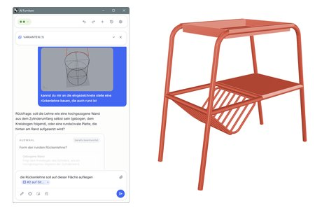
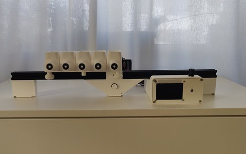
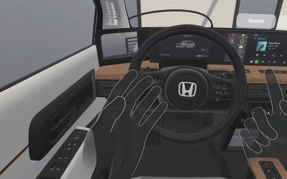
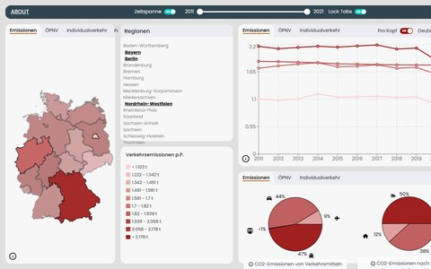
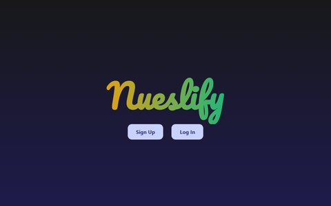
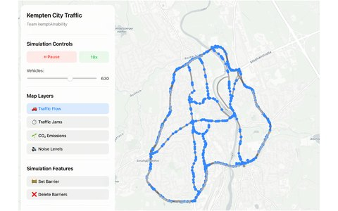
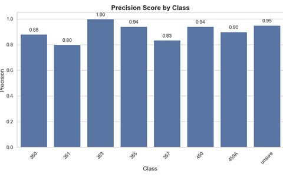
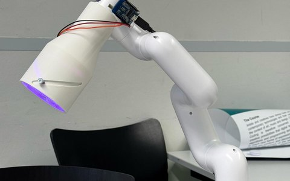
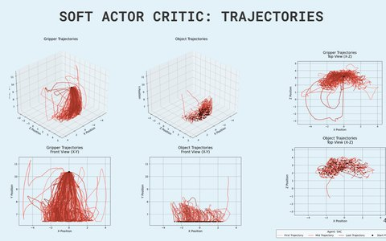
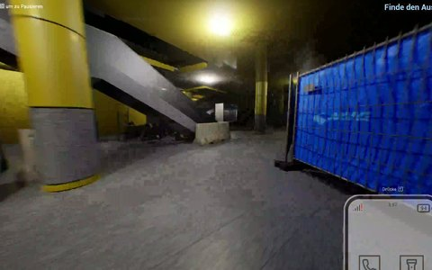

# Portfolio — Peter Trenkle

M.Sc. Medieninformatik an der LMU München (Abschluss vorauss. 2026), Schwerpunkt Mensch-Computer-Interaktion und KI-gestützte Werkzeuge. Dieses Repo sammelt meine Projekte — jeweils mit Problemstellung, Lösung, meiner Rolle und den eingesetzten Technologien.

> **🇬🇧 English summary:** Project portfolio of Peter Trenkle (M.Sc. Media Informatics at LMU Munich, graduating 2026) — ten projects across UX engineering, VR, frontend/full-stack development, and applied AI, each documented with images, my specific role, and the tech stack. Highlights: a chat-based AI CAD assistant for Rhino 8, built solo as my master's thesis (React/TypeScript + Python/FastAPI + Anthropic API, evaluated in a qualitative user study with 8 participants), a fully self-built AI-powered spice dispenser (CAD/3D printing + ESP32 + local LLM), and several team web projects (React, Next.js, D3). The pages are written in German — I'm happy to walk through any of them in English.

## Projekte

<table>
<tr>
<td align="center" width="33%"> <b><a href="projekte/ki-cad-assistent/">KI-CAD-Assistent</a></b> Masterarbeit · KI-Werkzeug für Rhino 8</td>
<td align="center" width="33%"> <b><a href="projekte/spice-dispenser/">SpAice</a></b> KI-Gewürzautomat · selbst gebaut</td>
<td align="center" width="33%"> <b><a href="projekte/bachelorarbeit-vr-fahrzeug/">VR im Fahrzeug</a></b> Bachelorarbeit · Nutzerstudie (n = 17)</td>
</tr>
<tr>
<td align="center"> <b><a href="projekte/e-mission-z/">E-Mission Z</a></b> Datenvisualisierung · React, D3</td>
<td align="center"> <b><a href="projekte/nueslify/">Nüslify</a></b> KI-Radio als PWA · Next.js</td>
<td align="center"> <b><a href="projekte/kemptainability/">kemptAInability</a></b> Verkehrssimulation · SUMO-Pipeline</td>
</tr>
<tr>
<td align="center"> <b><a href="projekte/intellitrack/">IntelliTrack</a></b> Indoor-Ortung per ML · Android</td>
<td align="center"> <b><a href="projekte/bloomie/">Bloomie</a></b> Gestengesteuerte Roboterlampe</td>
<td align="center"> <b><a href="projekte/grab-e/">GRAB-E</a></b> Reinforcement Learning · PyTorch</td>
</tr>
<tr>
<td align="center"> <b><a href="projekte/sendlingers-escape/">Sendlingers Escape</a></b> Escape-Game · Unreal Engine</td>
<td></td>
<td></td>
</tr>
</table>

### Im Überblick

| Projekt | Was es ist | Technologien |
|---|---|---|
| [KI-CAD-Assistent für Rhino 8](projekte/ki-cad-assistent/) | Masterarbeit: chatbasierter KI-Assistent mit Human-in-the-Loop-Werkzeugen, evaluiert in einer Nutzerstudie (n = 8) | React, TypeScript, Python, FastAPI, WebSockets, SQLite, Anthropic API |
| [SpAice](projekte/spice-dispenser/) | KI-gesteuerter Gewürzautomat, komplett selbst konstruiert und gebaut: Gericht nennen (Sprache/Text), lokales LLM bestimmt Gewürze + Mengen, die Maschine dosiert ([Video](https://youtu.be/Efl0KOGhpKA)) | CAD (Fusion 360), 3D-Druck, C++ (ESP32), PlatformIO, Python, Ollama, faster-whisper |
| [VR-Interaktion im virtuellen Fahrzeug](projekte/bachelorarbeit-vr-fahrzeug/) | Bachelorarbeit (Uni Regensburg, 2023): VR-Controller vs. Handtracking beim Bedienen eines virtuellen Autos — eigener Unity-Prototyp (Meta Quest 2, 10 Aufgaben) und Nutzerstudie mit 17 Teilnehmenden | Unity, Oculus Interaction SDK, Blender, UX-Research |
| [E-Mission Z](projekte/e-mission-z/) | Interaktives Dashboard zu Verkehr und CO₂-Emissionen der Bundesländer 2011–2021: Karte, Zeitreihe und Verkehrsmittel-Aufteilung als verknüpfte Ansichten (Teamprojekt, LMU) — meine Rolle: Zeitreihen-Diagramm, Zeitraum-Slider und die Kopplung der Ansichten ([live](https://www.cip.ifi.lmu.de/~wildva/infovis/)) | React, D3, Recharts, GeoJSON |
| [Nüslify](projekte/nueslify/) | Persönliches KI-Radio: KI-kuratierte News gemischt mit der eigenen Spotify-Musik, als PWA mit Live-Deployment (Teamprojekt) — meine Rolle: Interessen-Feature (UI bis DB) + Teile der Player-UI | Next.js, TypeScript, tRPC, Spotify-API |
| [kemptAInability](projekte/kemptainability/) | Interaktive Verkehrsfluss-Simulation für Kempten: Straßen sperren, Auswirkungen auf Stau/Lärm/CO₂ live sehen (Teamprojekt, sustAInability-Seminar HM+TUM) — meine Rolle: die komplette Datenpipeline (OSM → SUMO → GeoJSON) | React, SUMO, OpenStreetMap, Python |
| [IntelliTrack](projekte/intellitrack/) | Indoor-Ortung per WiFi-Fingerprinting: ML-Modell sagt den Raum im Gebäude aus WLAN-Signalstärken vorher — 92 % Genauigkeit (Teamprojekt, LMU) — meine Rolle: Android-App (Dashboard mit Gebäudeplan) | Python, XGBoost, Machine Learning, Android/Kotlin |
| [Bloomie](projekte/bloomie/) | Gestengesteuerte Schreibtischlampe an einem Roboterarm (HRI-Teamprojekt, LMU) — meine Rolle: Software gemeinsam im Co-Coding, dazu der Lampenkopf mit verstellbarem Lichtkegel (Zoom-Objektiv-Mechanik, 3D-Druck) + LED-Hardware | MyCobot/ROS, MediaPipe, Fusion 360, 3D-Druck, Hardware-Prototyping |
| [GRAB-E](projekte/grab-e/) | Simulierter 5-Achsen-Greifarm, der per Reinforcement Learning greifen und ablegen lernt — selbst implementierte SAC/TD3/DDPG gegen Standard-Baselines (Teamprojekt, LMU) — meine Rolle: Trainings- und Auswertungsinfrastruktur (Seeding, Logging, Baseline-Läufe) | Python, PyTorch, Stable-Baselines3, Unity ML-Agents |
| [Sendlingers Escape](projekte/sendlingers-escape/) | Escape-Game rund um das Sendlinger Tor München, Teamprojekt im LMU-Game-Development-Praktikum — meine Rolle: 3D-Objekt-Arbeit + erstes Rätsel ([Video](https://youtu.be/RlHncoayMY8)) | Unreal Engine, 3D-Modellierung |

*(Weitere Projekte folgen.)*

## Aufbau

Jedes Projekt liegt unter `projekte/<name>/` mit einer eigenen Seite nach dem gleichen Aufbau: **worum es geht → wie es gelöst ist → was mein Anteil war → welche Technologien im Einsatz waren**, dazu Bilder oder ein Video, wo vorhanden. Bei Teamprojekten ist mein Beitrag jeweils getrennt ausgewiesen und, wo Repo oder Bericht zugänglich sind, darüber belegt.
