# Portfolio — Peter Trenkle

M.Sc. Medieninformatik an der LMU München (Abschluss 2026). Die Projekte reichen von KI-Werkzeugen und Web-Anwendungen über VR bis zu Hardware-Prototypen und 3D-Konstruktionen. Jede Seite zeigt die Idee, die Umsetzung, meinen Beitrag und die eingesetzten Technologien.

**Kontakt:** [p.trenkle@web.de](mailto:p.trenkle@web.de) · [LinkedIn](https://www.linkedin.com/in/peter-trenkle)

> **English summary:** Project portfolio of Peter Trenkle (M.Sc. Media Informatics, LMU Munich, 2026) — eleven projects across AI tools, web apps, VR, hardware prototyping, and 3D design, each with my contribution and the tech stack. Highlights: an AI assistant for the CAD software Rhino 8 (master's thesis, evaluated in a user study with eight participants), an AI-powered spice dispenser (CAD, 3D printing, ESP32, local LLM), 143 parts I designed in Fusion 360 for 3D printing, and several team web projects (React, Next.js, D3). The pages are written in German — I'm happy to walk you through any of them in English.

## Projekte

<table>
<tr>
<td align="center" colspan="2" width="33%"><a href="projekte/ki-cad-assistent/">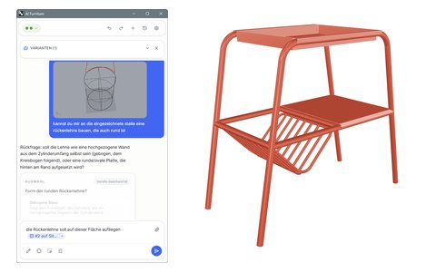</a> <b><a href="projekte/ki-cad-assistent/">KI-CAD-Assistent</a></b> Masterarbeit · KI-Werkzeug für Rhino 8</td>
<td align="center" colspan="2" width="33%"><a href="projekte/spice-dispenser/">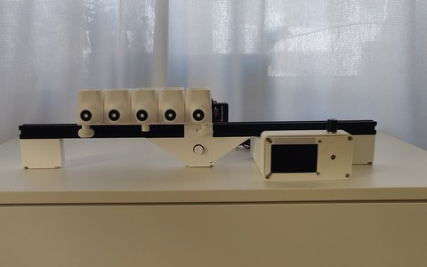</a> <b><a href="projekte/spice-dispenser/">SpAice</a></b> KI-Gewürzautomat · Hardware-Prototyp</td>
<td align="center" colspan="2" width="33%"><a href="projekte/konstruktionen/">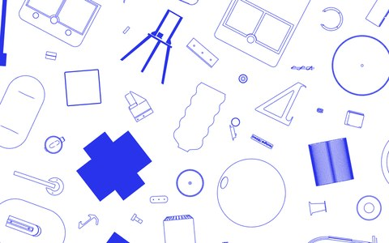</a> <b><a href="projekte/konstruktionen/">Konstruktionen</a></b> 143 Teile aus Fusion 360 · 3D-Druck</td>
</tr>
<tr>
<td align="center" colspan="2"><a href="projekte/bachelorarbeit-vr-fahrzeug/">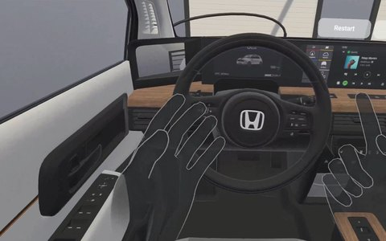</a> <b><a href="projekte/bachelorarbeit-vr-fahrzeug/">VR-Interaktion</a></b> Bachelorarbeit · Nutzerstudie (n = 17)</td>
<td align="center" colspan="2"><a href="projekte/e-mission-z/">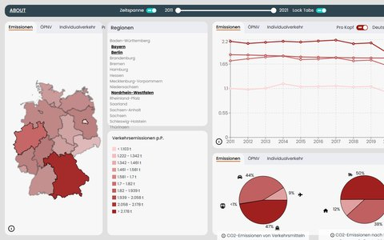</a> <b><a href="projekte/e-mission-z/">E-Mission Z</a></b> Datenvisualisierung · React, D3</td>
<td align="center" colspan="2"><a href="projekte/nueslify/">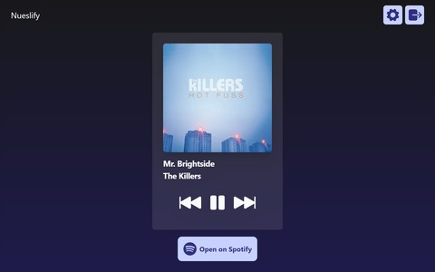</a> <b><a href="projekte/nueslify/">Nüslify</a></b> KI-Radio als PWA · Next.js</td>
</tr>
<tr>
<td align="center" colspan="2"><a href="projekte/kemptainability/">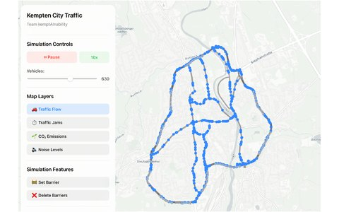</a> <b><a href="projekte/kemptainability/">kemptAInability</a></b> Verkehrssimulation · SUMO-Pipeline</td>
<td align="center" colspan="2"><a href="projekte/intellitrack/">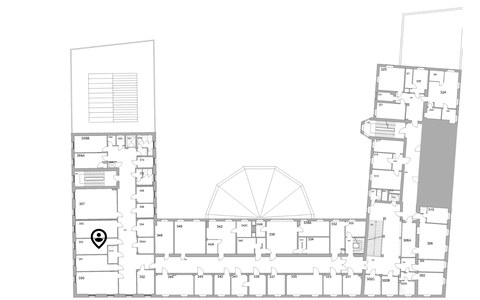</a> <b><a href="projekte/intellitrack/">IntelliTrack</a></b> Indoor-Ortung per ML · Android</td>
<td align="center" colspan="2"><a href="projekte/bloomie/">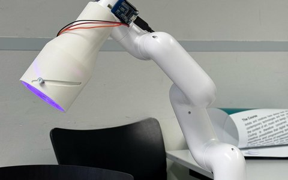</a> <b><a href="projekte/bloomie/">Bloomie</a></b> Roboterlampe · ROS, 3D-Druck</td>
</tr>
<tr>
<td align="center" colspan="3"><a href="projekte/grab-e/">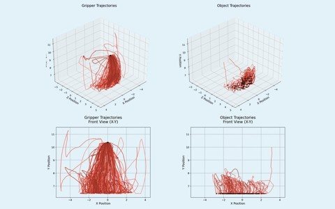</a> <b><a href="projekte/grab-e/">GRAB-E</a></b> Reinforcement Learning · PyTorch</td>
<td align="center" colspan="3"><a href="projekte/sendlingers-escape/">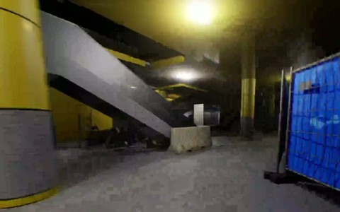</a> <b><a href="projekte/sendlingers-escape/">Sendlingers Escape</a></b> Escape-Game · Unreal Engine</td>
</tr>
</table>

### Im Überblick

| Projekt | Worum es geht | Mein Beitrag |
|---|---|---|
| [KI-CAD-Assistent für Rhino 8](projekte/ki-cad-assistent/) | Masterarbeit: KI-Assistent, mit dem man Möbel in Rhino per Chat, Klick, Regler und Skizze modelliert; Nutzerstudie mit 8 Teilnehmenden ([Video](https://youtu.be/Qb64zsemRec)) | Konzept, Entwicklung, Studie |
| [SpAice](projekte/spice-dispenser/) | Gewürzautomat: Gericht nennen, ein lokales Sprachmodell wählt Gewürze und Mengen, die Maschine dosiert ([Video](https://youtu.be/Efl0KOGhpKA)) | Konstruktion, Elektronik, Firmware, Software |
| [Konstruktionen](projekte/konstruktionen/) | 143 Teile nach Maß, konstruiert in Fusion 360 für den 3D-Druck | Konstruktion und Druck |
| [VR-Interaktion im virtuellen Fahrzeug](projekte/bachelorarbeit-vr-fahrzeug/) | Bachelorarbeit: Controller oder eigene Hände — wie bedient man ein virtuelles Auto besser? Nutzerstudie (n = 17) | Prototyp, Studie, Auswertung |
| [E-Mission Z](projekte/e-mission-z/) | Dashboard zu Verkehr und CO₂-Emissionen der Bundesländer mit verknüpften Ansichten ([Live-Version](https://www.cip.ifi.lmu.de/~wildva/infovis/)) | Zeitreihe, Zeitraum-Slider und die Kopplung der Ansichten |
| [Nüslify](projekte/nueslify/) | KI-Radio: News zu den eigenen Interessen, gemischt mit der eigenen Spotify-Musik | Interessen-Feature von der Oberfläche bis zur Datenbank |
| [kemptAInability](projekte/kemptainability/) | Verkehrssimulation für Kempten: Straßen sperren und die Folgen für Stau, Lärm und CO₂ sehen | Datenpipeline OSM → SUMO → GeoJSON |
| [IntelliTrack](projekte/intellitrack/) | Indoor-Ortung aus WLAN-Signalstärken, 92 % Genauigkeit | Android-App mit Gebäudeplan |
| [Bloomie](projekte/bloomie/) | Schreibtischlampe an einem Roboterarm, per Handgeste gesteuert | Lampenkopf mit verstellbarem Lichtkegel; Software gemeinsam im Team |
| [GRAB-E](projekte/grab-e/) | Simulierter Greifarm, der per Reinforcement Learning greifen lernt | Trainings- und Auswertungsinfrastruktur |
| [Sendlingers Escape](projekte/sendlingers-escape/) | Escape-Game in der Unreal Engine am Sendlinger Tor ([Video](https://youtu.be/RlHncoayMY8)) | 3D-Objekte und das erste Rätsel |
