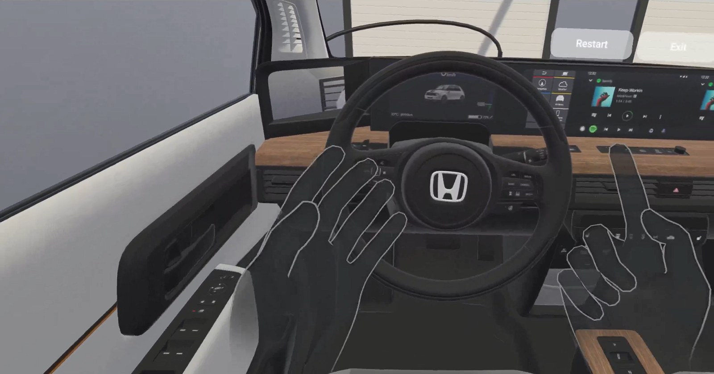
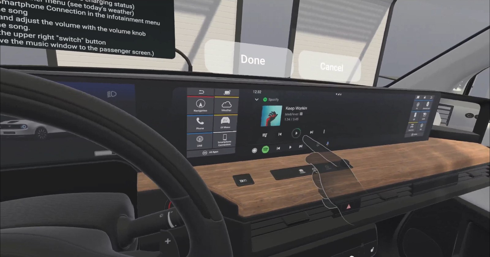
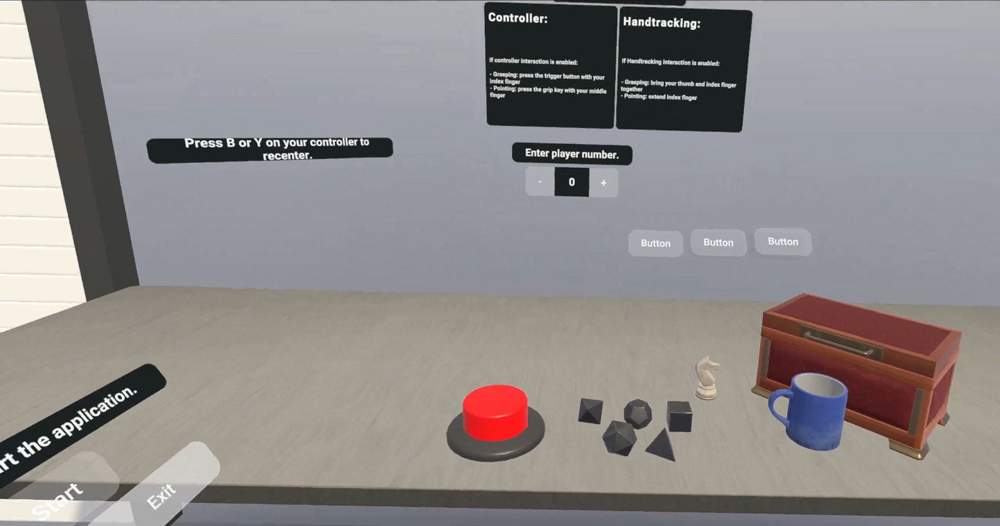

# VR-Interaktion im virtuellen Fahrzeug — Bachelorarbeit

**Wie bedient man ein Auto in Virtual Reality — mit Controllern oder mit den bloßen Händen?** Meine Bachelorarbeit „Vergleich von verschiedenen VR-Interaktionsmöglichkeiten innerhalb eines virtuellen Fahrzeugs" vergleicht die beiden Eingabemethoden in einem selbst gebauten VR-Prototyp und einer Nutzerstudie mit 17 Teilnehmenden.

*Das virtuelle Cockpit aus der Fahrerposition: Die eigenen Hände werden per Handtracking der Meta Quest 2 in Echtzeit erfasst — greifen, drücken, schieben und ziehen funktionieren direkt an den Fahrzeugkomponenten.*

| | |
|---|---|
| Kontext | Bachelorarbeit im Fach Medieninformatik, Universität Regensburg, abgegeben April 2023 · Solo-Arbeit |
| Rolle | Alles selbst: Prototyp (Unity, Oculus Interaction SDK), Fahrzeugszene, Studiendesign, Durchführung und Auswertung |
| Arbeit | Auf Anfrage — die PDF enthält persönliche Daten und ist deshalb nicht eingebettet |

## Der Prototyp

Ein VR-Prototyp für die Meta Quest 2, gebaut in Unity mit dem Oculus Interaction SDK, dazu Modellaufbereitung in Blender: Die Teilnehmenden sitzen am Steuer eines virtuellen Honda e in einer Garage und bedienen zehn Fahrzeugkomponenten — Hupe, Warnblinker, Scheibenwischer, Blinker, Fenster, Sonnenblende, Lenkrad (ein- und zweihändig), Innenspiegel, Außenspiegel und das Infotainment-System samt Lautstärke-Drehknopf.

Die Studieninfrastruktur steckt direkt im Prototyp: Die zehn Aufgaben sind nach Schwierigkeit geordnet vor dem Lenkrad wählbar, jede Aufgabe wird als Video- und Textbeschreibung an der Windschutzscheibe erklärt, Start- und Done-Buttons rahmen die Durchführung, und die Bearbeitungszeiten werden automatisch erfasst.

*Eine Aufgabe im Ablauf: Der getrackte Zeigefinger startet die Musik im Infotainment, oben rahmen Aufgabenbeschreibung und Done-Button die Messung.*

## Die Studie

Within-subjects-Studie mit **17 Teilnehmenden** (18–32 Jahre, alle mit Pkw-Führerschein): Jede Person absolvierte alle zehn Aufgaben einmal mit VR-Controllern und einmal per Handtracking, die Startmethode wurde zufällig zugeteilt. Vor dem eigentlichen Durchlauf machte sich jede Person in einer Übungsumgebung mit der jeweiligen Eingabemethode vertraut.

*Die Übungsumgebung: Greifobjekte, Knöpfe und Anleitungstafeln zum Eingewöhnen, bevor die gemessenen Aufgaben beginnen.*

Erhoben wurden Bearbeitungszeiten, Think-Aloud-Kommentare, Bildschirmaufnahmen und vier standardisierte Fragebögen (**UEQ**, **Presence Questionnaire**, **IPQ**, **AttrakDiff**) — pro Person und Methode.

## Zentrale Befunde

- **Handtracking fühlt sich realistischer an:** Die 1:1-Übertragung der eigenen Hand wurde als äußerst realistisch bewertet — etwa beim Fensterheber, wo man den Finger natürlich anwinkeln und unter den Knopf führen kann, was mit dem Controller kaum jemand herausfand.
- **Controller sind zuverlässiger und geben Feedback:** Vibration als haptische Rückmeldung wurde besonders bei kleinen Knöpfen als hilfreich empfunden; Greifen und Hebel-Bedienung erkannte das System mit Controllern robuster — beim Handtracking „klebten" Hebel teils an der Hand, wenn die Griffunterbrechung nicht erkannt wurde.
- **Die schwierigsten Interaktionen** waren Innenspiegel und Lautstärke-Drehknopf; bei Präzisionsaufgaben wechselten viele spontan zur stärkeren Hand.

Die Arbeit leitet daraus ab, wofür sich welche Methode im Fahrzeugkontext eignet — Feinmotorik und Realismus sprechen für Handtracking, Zuverlässigkeit und Feedback für Controller.

## Technologien

Unity · Oculus Interaction SDK · Meta Quest 2 (Handtracking + Controller) · Blender (Modellaufbereitung) · Studiendesign (within-subjects) · standardisierte UX-Fragebögen (UEQ, PQ, IPQ, AttrakDiff) · Think-Aloud
