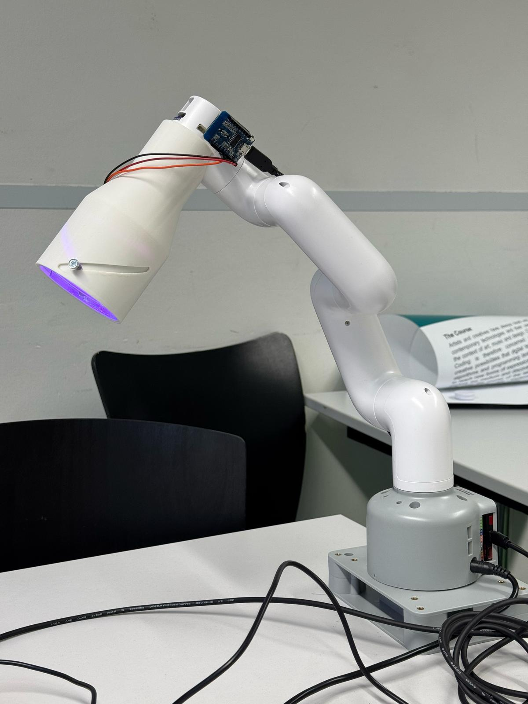
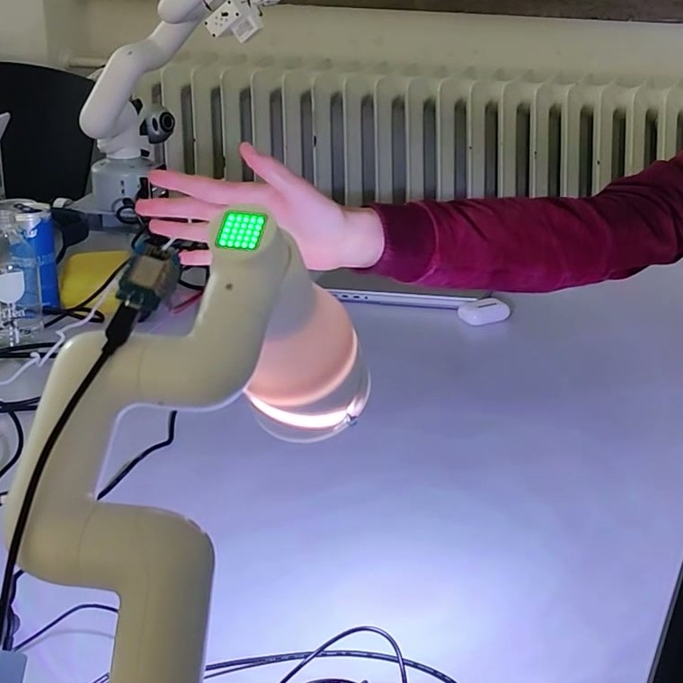
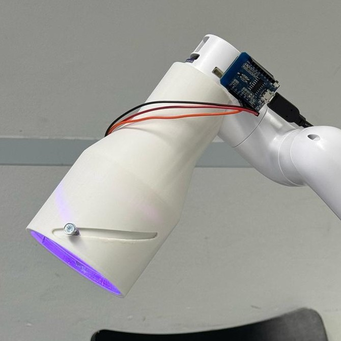

# Bloomie — gestengesteuerte Schreibtischlampe an einem Roboterarm (HRI-Teamprojekt)

**Bloomie ist eine smarte Schreibtischlampe auf einem Roboterarm, die sich berührungslos über Handgesten steuern lässt** — entstanden als vierköpfiges Teamprojekt im Kurs Human-Robot Interaction (LMU München, 2025).

| | |
|---|---|
| Kontext | Kurs Human-Robot Interaction (HRI), LMU München, 2025 · 4-köpfiges Team |
| Rolle | Lampenkopf mit verstellbarem Lichtkegel (Linsenmechanik nach dem Zoom-Objektiv-Prinzip) + LED-Hardware |
| Projektbericht | **[Paper als PDF](bloomie-paper.pdf)** (ACM-Format) |

*Bloomie komplett: der MyCobot-280-Arm mit dem 3D-gedruckten Lampenkopf. Am Kopf sichtbar: die Schrägnut mit Führungsstift (mein Verstellmechanismus) und das ESP8266-Board für die LED-Ansteuerung.*

## Die Idee

Im HRI-Kurs haben wir als vierköpfiges Team ein eigenes Mensch-Roboter-Interaktionssystem konzipiert, gebaut und als Paper im ACM-Format dokumentiert. Unser Ausgangspunkt: Klassische Schreibtischlampen sind unflexibel — für jede Änderung muss man hinlangen und nachjustieren. Bloomie beantwortet das mit einer Lampe, die sich berührungslos bedienen lässt und selbst mitdenkt: Sie folgt auf Wunsch der Hand, passt Position und Licht an und macht so aus einem Alltagsgegenstand einen adaptiven Interaktionspartner.

## Das System

Eine Webcam erfasst die Hand, Googles MediaPipe erkennt in Echtzeit 21 Hand-Landmarken, und ein ROS-System aus drei Nodes (Kamera, Roboter, Licht) übersetzt die Gesten in Bewegungen eines MyCobot-280-Roboterarms. Vier Modi: Gestensteuerung (Richtungsgesten bewegen die Lampe), Follow-Modus (die Lampe folgt der Hand), Licht-Modus und Haltungs-Modus (voreingestellte Posen). Da die GPIO-Pins des Roboterarms nicht zugänglich waren, steuert ein externer ESP8266-Mikrocontroller die LED-Ringe. Unsere Tests bestätigten eine zuverlässige Gestenerkennung; Grenzen zeigten sich bei den Winkelberechnungen einzelner Armposen — beides ist im Paper offen dokumentiert.

*Gestensteuerung im Betrieb: Die Hand schwebt über dem Lampenkopf — oben leuchtet die grüne LED-Matrix, unten das warme Arbeitslicht. Standbild aus dem Projektvideo.*

## Mein Beitrag: der Lampenkopf mit verstellbarem Lichtkegel

*Der Lampenkopf im Detail: In der Schrägnut läuft der Führungsstift, der beim Rotieren der Rohre die Linse hebt und senkt. Oben das ESP8266-Board (D1 Mini), unten der LED-Ring.*

- **Linsenmechanik nach dem Zoom-Objektiv-Prinzip:** Vor den LEDs sitzt eine bewegliche Linse, die den Lichtkegel stufenlos von breitem Ambient-Licht bis zum eng gebündelten Arbeits-Spot verändert. Umgesetzt über einen Schrägnut-Mechanismus wie in einem Kamera-Zoom: Außen- und Innenrohr tragen gegenläufige Führungsnuten, ein Führungsstift am Linsenhalter greift in beide — rotieren die Rohre gegeneinander, fährt die Linse präzise hoch oder runter.
- **Der Clou dabei:** Die Rotation kommt vom obersten Drehgelenk des Roboterarms selbst — der Mechanismus braucht keinen zusätzlichen Motor.
- **Konstruktion:** Lampenkopf als 3D-Druck, Befestigung am Arm über LEGO-kompatible Pins (Plug-and-Play).
- **LED-Hardware:** Einbau der LED-Ringe samt Ansteuerung im Lampenkopf.

## Technologien

| Ebene | Eingesetzt |
|---|---|
| Robotik | MyCobot 280 M5 · ROS (3-Node-Architektur) · Pymycobot |
| Computer Vision | MediaPipe (Hand-Tracking, 21 Landmarken) · OpenCV · Webcam |
| Licht/Hardware | 3D-gedruckter Lampenkopf · Linsenmechanik (Schrägnut-Prinzip) · ESP8266 (D1 Mini) + LED-Ringe |
