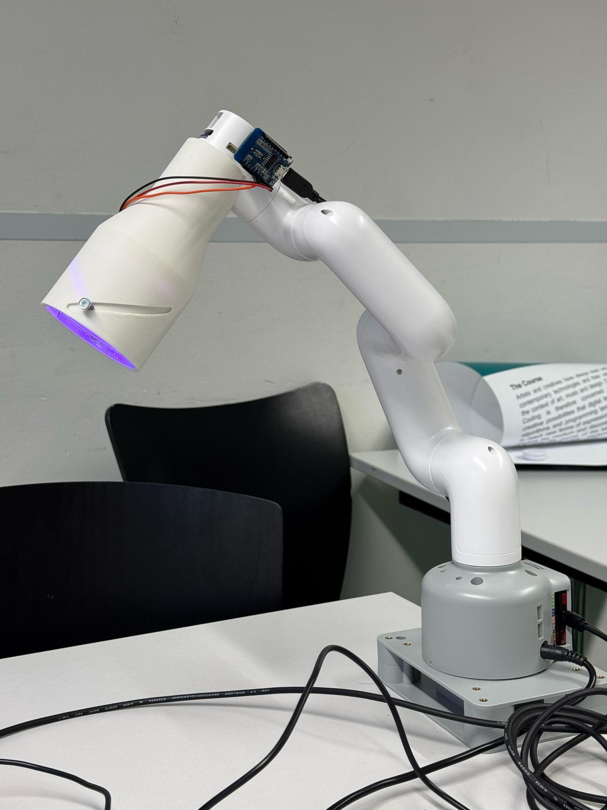
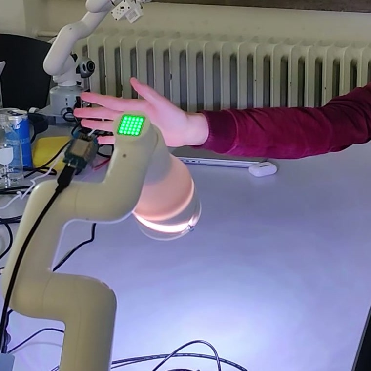
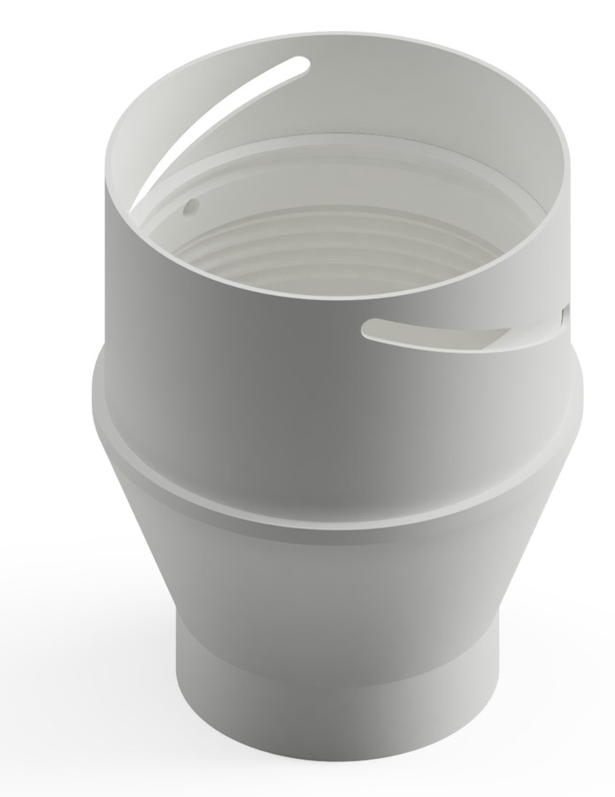
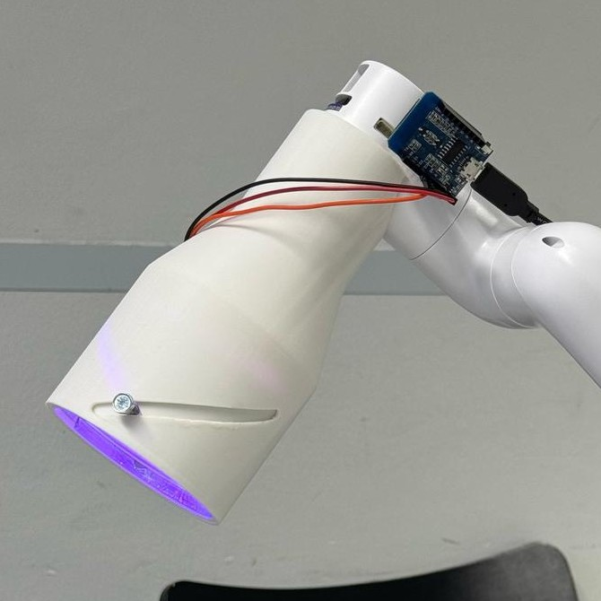

# Bloomie: gestengesteuerte Schreibtischlampe an einem Roboterarm

**Bloomie ist eine Schreibtischlampe an einem Roboterarm, die sich berührungslos über Handgesten steuern lässt.**

*Bloomie komplett: der MyCobot-280-Arm mit dem 3D-gedruckten Lampenkopf. Am Kopf sichtbar: die Schrägnut mit Führungsstift (mein Verstellmechanismus) und das ESP8266-Board für die LED-Ansteuerung.*

| | |
|---|---|
| Kontext | Kurs Human-Robot Interaction, LMU München, WiSe 2024/25 · 4-köpfiges Team |
| Rolle | Lampenkopf mit verstellbarem Lichtkegel nach dem Zoom-Objektiv-Prinzip: Konstruktion, Druck und LED-Hardware · Software gemeinsam im Team (Co-Coding: ROS, MediaPipe, Robotersteuerung) |
| Bericht | [Paper als PDF](bloomie-paper.pdf) (ACM-Format) |

## Die Idee

Im Kurs haben wir im Team ein eigenes Mensch-Roboter-Interaktionssystem konzipiert, gebaut und als Paper im ACM-Format dokumentiert. Unser Ausgangspunkt: Klassische Schreibtischlampen sind unflexibel. Für jede Änderung muss man hinlangen und nachjustieren. Bloomie ist eine Lampe, die sich berührungslos bedienen lässt: Sie folgt auf Wunsch der Hand, fährt voreingestellte Posen an und steuert das Licht per Geste.

## Wie es funktioniert

Eine Webcam erfasst die Hand, Googles MediaPipe erkennt in Echtzeit 21 Hand-Landmarken, und ein ROS-System aus drei Nodes (Kamera, Roboter, Licht) übersetzt die Gesten in Bewegungen eines MyCobot-280-Roboterarms. Vier Modi: Gestensteuerung (Richtungsgesten bewegen die Lampe), Follow-Modus (die Lampe folgt der Hand), Licht-Modus und Haltungs-Modus (voreingestellte Posen). Da die GPIO-Pins des Roboterarms nicht zugänglich waren, steuert ein externer ESP8266-Mikrocontroller die LED-Ringe. Unsere Tests bestätigten eine zuverlässige Gestenerkennung; Grenzen zeigten sich bei den Winkelberechnungen einzelner Armposen. Beides ist im Paper offen dokumentiert.

*Gestensteuerung im Betrieb: Die Hand schwebt über dem Lampenkopf, oben leuchtet die grüne LED-Matrix, unten das warme Arbeitslicht. Standbild aus dem Projektvideo.*

## Mein Beitrag

Den Lampenkopf mit dem verstellbaren Lichtkegel habe ich konstruiert und gebaut. Die Software haben wir im Team per Co-Coding geschrieben, also gemeinsam am selben Code statt nach Modulen aufgeteilt.

### Lampenkopf mit verstellbarem Lichtkegel

*Links mein CAD-Entwurf des Lampenkopfs (Fusion 360, gerendert) mit den schräg verlaufenden Führungsnuten. Rechts der gedruckte Lampenkopf am Arm: In der Schrägnut läuft der Führungsstift, der beim Rotieren der Rohre die Linse hebt und senkt. Oben das ESP8266-Board (D1 Mini), unten der LED-Ring.*

- **Linsenmechanik nach dem Zoom-Objektiv-Prinzip:** Vor den LEDs sitzt eine bewegliche Linse, die den Lichtkegel stufenlos von breitem Ambient-Licht bis zum eng gebündelten Arbeits-Spot verändert. Umgesetzt über einen Schrägnut-Mechanismus wie in einem Kamera-Zoom: Außen- und Innenrohr tragen gegenläufige Führungsnuten, ein Führungsstift am Linsenhalter greift in beide. Rotieren die Rohre gegeneinander, fährt die Linse präzise hoch oder runter.
- **Ohne eigenen Motor:** Die Rotation kommt vom obersten Drehgelenk des Roboterarms selbst.
- **Konstruktion:** Lampenkopf in Fusion 360 konstruiert und im 3D-Druck gefertigt, Befestigung am Arm über LEGO-kompatible Pins (Plug-and-Play).
- **LED-Hardware:** Einbau der LED-Ringe samt Ansteuerung im Lampenkopf.

### Software

- **ROS-Architektur aus drei Nodes:** Kamera-Node für Handtracking und Gestenerkennung, Roboter-Node für die Armbewegung, Licht-Node für die LEDs
- **Gestenerkennung mit MediaPipe:** Die Modi werden über Fingerstellungen umgeschaltet, Richtungsgesten über Winkel zwischen Handgelenk und Zeigefinger erkannt. Eine Geste gilt erst, wenn sie über mehrere Frames stabil bleibt.
- **Robotersteuerung über die MyCobot-API:** MoveIt war für die Echtzeit-Steuerung zu träge, deshalb steuern wir die Gelenke direkt an (`jog_angle`, `send_angles`). Im Follow-Modus ignoriert eine Toleranzzone kleine Handbewegungen.
- **Licht-Anbindung:** Licht-Gesten werden in serielle Befehle an den ESP8266 übersetzt (zwei Skripte: Gestenlogik und serielle Verbindung)

## Technologien

| Ebene | Eingesetzt |
|---|---|
| Licht/Hardware | Lampenkopf in Fusion 360 konstruiert, 3D-gedruckt · Linsenmechanik (Schrägnut-Prinzip) · ESP8266 (D1 Mini) + LED-Ringe |
| Robotik | MyCobot 280 M5 · ROS (3-Node-Architektur) · Pymycobot |
| Computer Vision | MediaPipe (Handtracking, 21 Landmarken) · OpenCV · Webcam |
