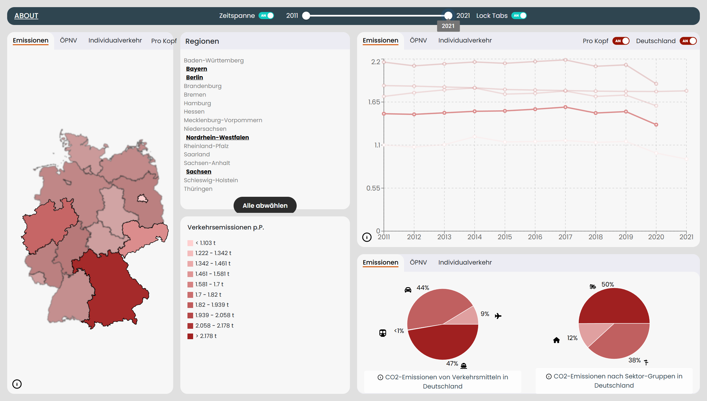

# E-Mission Z — interaktive Visualisierung von Verkehr und CO₂-Emissionen (Teamprojekt)

**Hängen die Verkehrsmittel, die ein Bundesland nutzt, mit seinen Pro-Kopf-CO₂-Emissionen zusammen?** E-Mission Z macht diese Frage explorierbar: eine Dashboard-Anwendung, in der man Bundesländer auswählt, den Zeitraum von 2011 bis 2021 aufzieht und Karte, Zeitreihe und Verkehrsmittel-Aufteilung als verknüpfte Ansichten nebeneinander liest.

*Das Dashboard mit vier ausgewählten Bundesländern: links die Choroplethenkarte, rechts oben die Zeitreihe der Pro-Kopf-Emissionen, rechts unten die Aufteilung nach Verkehrsmitteln. Auswahl und Zeitraum wirken auf alle Ansichten gleichzeitig.*

| | |
|---|---|
| Kontext | Kurs Information Visualization, LMU München, WiSe 2023/24 · 5-köpfiges Team |
| Rolle | Zeitreihen-Diagramm, Zeitraum-Slider, Bundesland-Auswahlliste und deren Verknüpfung mit der Karte |
| Live | **[www.cip.ifi.lmu.de/~wildva/infovis/](https://www.cip.ifi.lmu.de/~wildva/infovis/)** |
| Code | LRZ-GitLab der LMU (nicht öffentlich einsehbar) — Einblick auf Anfrage |

## Die Fragestellung

Verkehr ist einer der größten CO₂-Verursacher, aber die Daten dazu liegen verstreut: Emissionen pro Bundesland, Fahrgastzahlen im ÖPNV, Personenkilometer im Individualverkehr. E-Mission Z bringt sie in ein gemeinsames Dashboard und lässt Nutzer:innen selbst nach Mustern suchen — etwa nach dem Effekt von Corona und 9-Euro-Ticket auf die Kurven.

Der Kern ist das Prinzip verknüpfter Ansichten: Wer ein Bundesland in der Liste anwählt, sieht es gleichzeitig auf der Karte hervorgehoben und als Serie im Zeitreihen-Diagramm. Wer den Zeitraum ändert, ändert ihn überall. Dadurch wird der Vergleich zwischen Regionen und über die Zeit zu einer einzigen zusammenhängenden Bewegung statt zu mehreren getrennten Ablesevorgängen.

## Mein Beitrag

Mit **77 von 295 Commits** hatte ich den größten Einzelanteil im fünfköpfigen Team. Mein Schwerpunkt lag auf der Zeitreihen-Seite des Dashboards und den Bedienelementen, die die Ansichten miteinander koppeln:

- **Das Zeitreihen-Diagramm** (`BasicLineChart`): Aufbau der Komponente, Achsen und Skalierung auf die Emissionsdaten, Farbgebung synchron zur Karte, Hervorhebung der Linie beim Hovern über ein Bundesland, Umgang mit dem Wechsel der Datengrundlage.
- **Der Zeitraum-Slider** (`MultiRangeSlider`) mit zwei Griffen für Start- und Endjahr, plus der Umschalter zwischen absoluten und Pro-Kopf-Werten (`ToggleSwitch`) — beides Elemente, die auf alle Ansichten gleichzeitig wirken.
- **Die Bundesland-Auswahlliste** (`StateList`): Auswahl- und Hover-Zustände sowie die Verdrahtung, über die eine Auswahl gleichzeitig Karte und Diagramm erreicht.
- **Zusammenführung der Komponenten** in der App-Struktur (`App.js`, 28 Commits) und Anbindung der Kartenkomponente an den geteilten Auswahlzustand.

## Technologien

| Ebene | Eingesetzt |
|---|---|
| Frontend | React 18 · React Router · styled-components · MUI |
| Visualisierung | D3 · Recharts · chroma-js (Farbskalen) · GeoJSON-Choroplethenkarte |
| UX | intro.js (geführtes Onboarding) · react-tooltip · allotment (teilbare Panels) |
| Daten | Aufbereitung amtlicher Emissions- und Verkehrsstatistiken zu JSON (Jupyter/pandas) |
