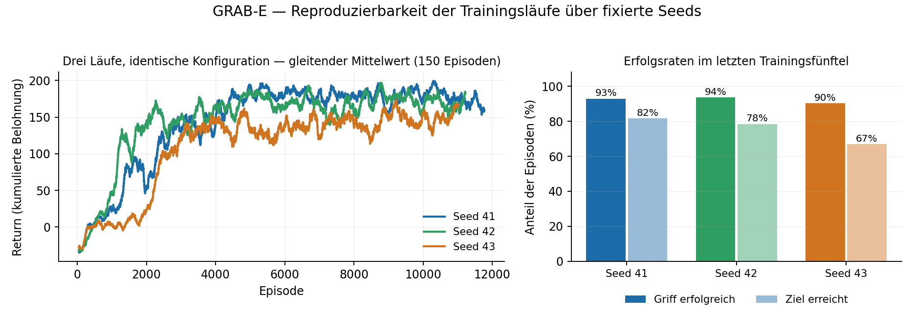

# GRAB-E — Reinforcement Learning für einen simulierten Greifarm (Teamprojekt)

**Ein 5-Achsen-Roboterarm lernt in einer Unity-Simulation, einen Würfel zu greifen und an einem Zielort abzulegen** — trainiert mit selbst implementierten Reinforcement-Learning-Verfahren (SAC, TD3, DDPG) und gegen Standard-Baselines verglichen. Entstanden als fünfköpfiges Teamprojekt im Praktikum Autonome Systeme.

*Drei Läufe derselben Konfiguration mit den fixierten Seeds 41, 42 und 43 (PPO-Baseline, 3 Mio. Schritte). Links die geglätteten Lernkurven, rechts die Erfolgsraten im letzten Trainingsfünftel. Erzeugt aus den Logdateien meiner Trainings-Infrastruktur — die Streuung zwischen den Seeds ist genau das, was sie sichtbar machen soll.*

| | |
|---|---|
| Kontext | Praktikum Autonome Systeme (ASP), LMU München, WiSe 2024/25 · 5-köpfiges Team |
| Rolle | Trainings- und Auswertungsinfrastruktur: Seeding und Reproduzierbarkeit, Ergebnis-Logging, Baseline-Läufe, Hyperparameter-Tuning |
| Simulation | Unity3D (5-DOF-Arm, Niryo One) mit Python-Anbindung, ONNX-Export zurück in die Simulation |
| Code | LRZ-GitLab der LMU (nicht öffentlich einsehbar) — Einblick auf Anfrage |

## Das Projekt

Die Umgebung ist ein Unity-Nachbau eines fünfachsigen Greifarms, angebunden an ein Python-Interface — der Arm bekommt Gelenkwinkel als Aktionen und liefert Zustand und Belohnung zurück. Aufgabe: den Würfel finden, greifen und am Ziel absetzen.

Das Team implementierte die Lernverfahren selbst statt fertige Bibliotheken zu benutzen: **Soft Actor-Critic (SAC)** mit adaptivem Alpha und einem evolutionären Ansatz zur Actor-Auswahl, **TD3** mit priorisiertem Replay-Buffer und OU-Rauschen, **DDPG**, dazu einfachere Policy-, Policy-Value- und Policy-Q-Netze als Zwischenstufen zum Verständnis. Zum Vergleich liefen Baselines aus Stable-Baselines3 sowie eine Zufalls-Baseline.

Die Belohnungsfunktion kombiniert dichte Strafterme (Abstand zum Würfel, Abstand zum Ziel, Kollisionen, Schrittzahl) mit seltenen positiven Signalen (erfolgreicher Griff, Ziel erreicht) und Delta-Belohnungen, die die Verbesserung gegenüber dem vorigen Schritt bewerten.

## Mein Beitrag: dass die Ergebnisse vergleichbar und wiederholbar sind

Mein Schwerpunkt war die Experimentier-Infrastruktur — die Schicht, die einen Vergleich von fünf Algorithmen über hunderte Trainingsläufe erst aussagekräftig macht.

- **Seeding für Reproduzierbarkeit:** ein zentrales Utility, das den Zufall über alle Trainingsskripte hinweg auf einen gesetzten Seed festlegt, damit Läufe wiederholbar werden und Unterschiede zwischen Algorithmen nicht bloß Zufallsstreuung sind.
- **Ergebnis-Logging:** einheitliches CSV-Format für Return, Episodenlänge, Grifferfolg und Zielerreichung pro Episode, mit Algorithmus- und Laufkennung im Dateikopf — die Datengrundlage aller Auswertungen und Plots des Projekts. Dazu das Speichern der Episoden-Trajektorien für die räumlichen Auswertungen.
- **Baseline-Läufe:** Aufsetzen und Durchführen der Stable-Baselines3-Trainings (PPO, DDPG) über mehrere Seeds und bis zu drei Millionen Schritte, inklusive Korrekturen an der Ergebnis- und Trajektorienablage.
- **Hyperparameter-Tuning und Trainingsläufe** für mehrere Algorithmen, dokumentiert in einer gemeinsamen Parametertabelle.
- **Nachvollziehbarkeit im Code:** Kommentierung und Aufräumen der SAC- und DDPG-Implementierungen sowie der Trainingsskripte, damit die Abgabe für Außenstehende lesbar ist.

## Technologien

| Ebene | Eingesetzt |
|---|---|
| Reinforcement Learning | PyTorch · Stable-Baselines3 · SAC / TD3 / DDPG · Replay-Buffer, OU-Rauschen, Reward-Shaping |
| Simulation | Unity3D · Unity ML-Agents · ONNX-Export · Python-Unity-Side-Channel |
| Experimente | Seeding und Reproduzierbarkeit · CSV-Logging · Hyperparameter-Tuning · Auswertung mit pandas/matplotlib |
