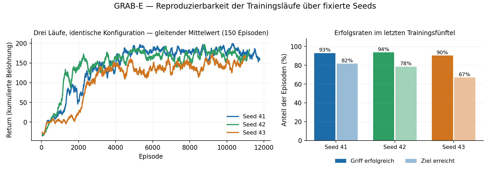
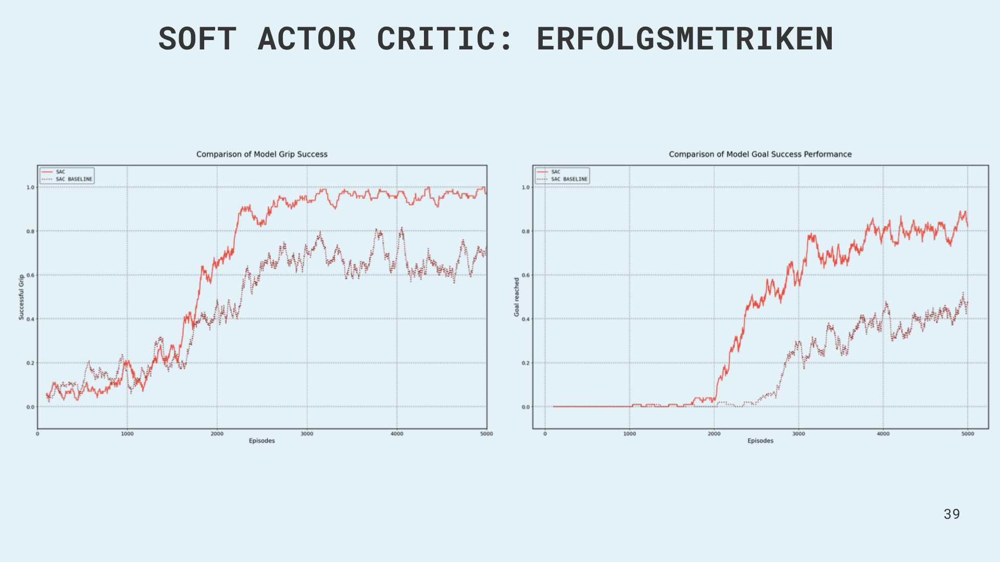
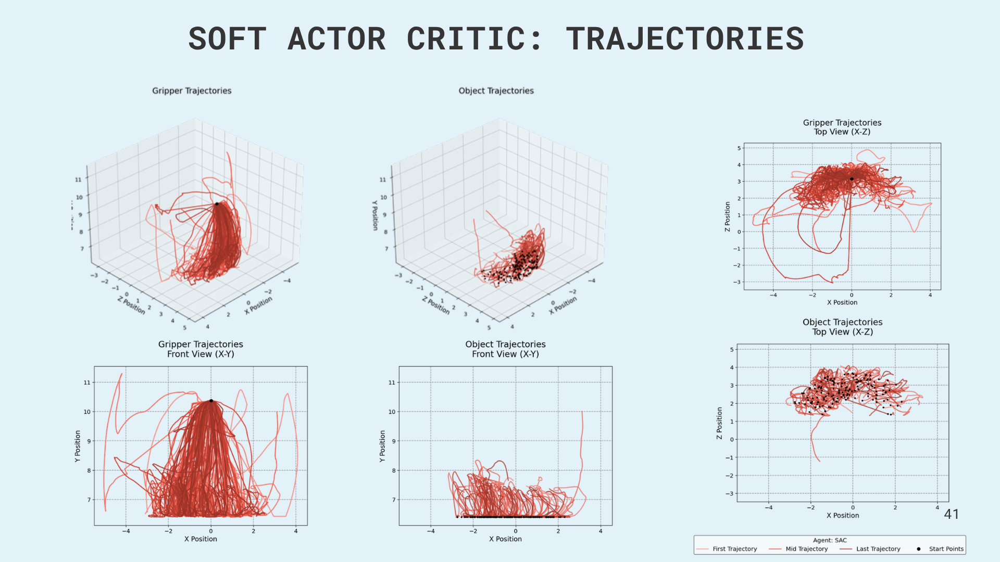
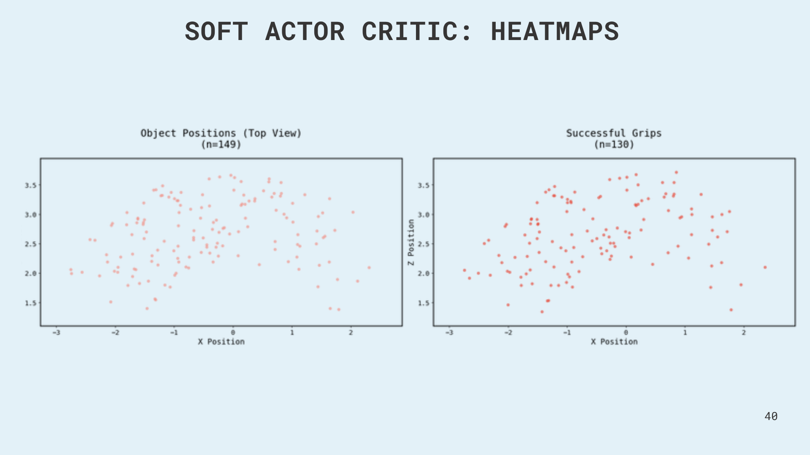

# GRAB-E: Reinforcement Learning für einen simulierten Greifarm

**Ein Roboterarm lernt in einer Unity-Simulation, einen Würfel zu greifen und an einem Zielort abzulegen.** Dafür hat das Team Reinforcement-Learning-Verfahren (SAC, TD3, DDPG) selbst implementiert und mit Standard-Baselines verglichen.

*Drei Läufe derselben Konfiguration mit den fixierten Seeds 41, 42 und 43 (PPO-Baseline, 3 Mio. Schritte). Links die geglätteten Lernkurven, rechts die Erfolgsraten im letzten Trainingsfünftel. Erzeugt aus den Logdateien meiner Trainingsinfrastruktur, die genau solche Streuung zwischen den Seeds sichtbar machen soll.*

| | |
|---|---|
| Kontext | Praktikum Autonome Systeme, LMU München, WiSe 2024/25 · 5-köpfiges Team |
| Rolle | Trainings- und Auswertungsinfrastruktur: Seeding und Reproduzierbarkeit, Ergebnis-Logging, Baseline-Läufe, Hyperparameter-Tuning |
| Code | LRZ-GitLab der LMU (nicht öffentlich einsehbar), Einblick auf Anfrage |

## Die Idee

Im Praktikum Autonome Systeme haben wir uns im Team zwei Fragen vorgenommen: Kann ein Greifarm eine Pick-and-Place-Aufgabe rein durch Reinforcement Learning lernen? Und wie schlagen sich selbst implementierte Verfahren gegen etablierte Bibliotheken?

## Wie es funktioniert

Die Umgebung ist eine Unity-Simulation des sechsachsigen Roboterarms Niryo One, aufgebaut auf dem Pick-and-Place-Tutorial des Unity Robotics Hub und angebunden an ein Python-Interface. Der Agent steuert fünf der Gelenke: Er gibt Gelenkwinkel als Aktionen vor und bekommt Zustand und Belohnung zurück. Aufgabe: den Würfel finden, greifen und am Ziel absetzen. Belohnt wird, wenn der Arm dem Würfel und dem Ziel näherkommt, greift und absetzt; Kollisionen und unnötige Schritte kosten Punkte.

Den eigenen Implementierungen (SAC, TD3, DDPG und einfachere Vorstufen) standen fertige Baselines aus Stable-Baselines3 und eine Zufalls-Baseline gegenüber. Das Ergebnis des Vergleichs: **SAC erzielte die beste Performance**: robust und stabil, mit Grifferfolgsraten nahe 100 % spät im Training. TD3 konvergierte schneller, litt aber unter lokalen Optima.

*Aus unserer Abschlusspräsentation: Grifferfolg (links) und Zielerreichung (rechts) unseres SAC gegenüber der SAC-Baseline über 5.000 Episoden, erzeugt aus den Logdaten der Trainingsinfrastruktur.*

## Mein Beitrag

Mein Schwerpunkt war die Experimentier-Infrastruktur: Sie sorgt dafür, dass die Ergebnisse vergleichbar und wiederholbar sind und sich die Algorithmen über viele Trainingsläufe hinweg fair vergleichen lassen.

- **Seeding für Reproduzierbarkeit:** ein zentrales Hilfsmodul, das den Zufall über alle Trainingsskripte hinweg auf einen gesetzten Seed festlegt, damit Läufe wiederholbar werden und Unterschiede zwischen Algorithmen nicht bloß Zufallsstreuung sind.
- **Ergebnis-Logging:** einheitliches CSV-Format für Return, Episodenlänge, Grifferfolg und Zielerreichung pro Episode, mit Algorithmus- und Laufkennung im Dateikopf. Das ist die Datengrundlage aller Auswertungen und Plots des Projekts. Dazu das Speichern der Episoden-Trajektorien für die räumlichen Auswertungen.
- **Baseline-Läufe:** Aufsetzen und Durchführen der Stable-Baselines3-Trainings (PPO, DDPG) über mehrere Seeds und bis zu drei Millionen Schritte, inklusive Korrekturen an der Ergebnis- und Trajektorienablage.
- **Hyperparameter-Tuning und Trainingsläufe:** für mehrere Algorithmen, dokumentiert in einer gemeinsamen Parametertabelle.
- **Nachvollziehbarkeit im Code:** Kommentierung und Aufräumen der SAC- und DDPG-Implementierungen sowie der Trainingsskripte, damit die Abgabe für Außenstehende lesbar ist.

Was aus diesen Logdaten wurde, zeigen die Auswertungen der Abschlusspräsentation:

*Trajektorien-Auswertung aus den geloggten Episodenpfaden: Greifer- und Objektbewegungen des SAC-Agenten in 3D und als Draufsicht/Frontansicht.*

*Heatmap-Auswertung: wo im Arbeitsraum die Objekte lagen (links) und wo Griffe gelangen (rechts), also die räumliche Erfolgsverteilung des trainierten Agenten.*

## Technologien

| Ebene | Eingesetzt |
|---|---|
| Reinforcement Learning | PyTorch · Stable-Baselines3 · SAC / TD3 / DDPG · Reward-Shaping |
| Simulation | Unity · Unity ML-Agents · ONNX-Export · Python-Unity-Side-Channel |
| Experimente | Seeding und Reproduzierbarkeit · CSV-Logging · Hyperparameter-Tuning · Auswertung mit pandas/matplotlib |
