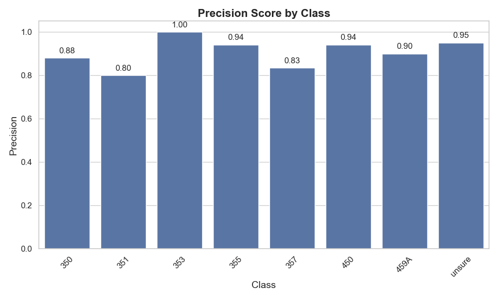

# IntelliTrack — Indoor-Ortung per WiFi-Fingerprinting und Machine Learning (Teamprojekt)

**Wo bin ich im Gebäude, wenn GPS nicht funktioniert?** IntelliTrack sagt den Raum, in dem sich ein Smartphone befindet, allein aus den empfangenen WLAN-Signalstärken vorher — als Grundlage für Indoor-Navigation über einen Gebäudeplan, z. B. in Unikliniken, Universitäten oder öffentlichen Gebäuden.

| | |
|---|---|
| Kontext | Praktikum Intelligent Interactive Systems (PIIS), LMU München, WiSe 2023/24 · 4-köpfiges Team |
| Ergebnis | **92 % Raum-Vorhersagegenauigkeit** (XGBoost, 5-fach-Kreuzvalidierung) |
| Rolle | Android-App: Dashboard mit Gebäudeplan (Marker, Stockwerk-Wechsel) und WLAN-Scan-Ansicht |
| Bericht | **[Paper als PDF](intelliTrack-paper.pdf)** (ACM-Format) |

## Der Kurs und die Idee

Im Praktikum Intelligent Interactive Systems baut jedes Team über das Semester ein intelligentes interaktives System und dokumentiert es als Paper im ACM-Format. Unser Team hat sich der Indoor-Ortung angenommen: GPS fällt in Gebäuden aus, aber WLAN-Netze sind fast überall — und ihre Signalstärken bilden pro Raum ein charakteristisches Muster, einen „Fingerprint", den ein Machine-Learning-Modell wiedererkennen kann.

## Ansatz

1. **Datensammlung:** Eine eigene Android-App scannt in festen Intervallen alle empfangbaren WLAN-Netze und erfasst Signalstärke (dBm), SSID/BSSID, Frequenz und Kanalbreite — geloggt in verschiedenen Räumen samt angrenzender Außenbereiche, mit randomisierten Bewegungsmustern gegen Verzerrung.
2. **Preprocessing:** Normalisierung der Signalstärken, Ausreißer-Filterung, Feature-Extraktion und Dimensionsreduktion. Ein zentraler Befund dabei: 5-GHz-Netze liefern deutlich konsistentere Daten und trennen Räume besser als 2,4 GHz.
3. **Modellvergleich:** Decision Tree als Baseline (80,8 %), Random Forest (86,4 %), XGBoost (92,0 %) — jeweils mit 5-fach-Kreuzvalidierung evaluiert; Hyperparameter-Tuning per GridSearch.

## Mein Beitrag: die Android-App

Das Nutzer-Frontend des Systems ist eine Android-App (Kotlin), an der ich einen der beiden Hauptanteile hatte (20 von 44 Commits):

- **Dashboard mit interaktivem Gebäudeplan:** Kartenansicht mit Positions-Markern und Stockwerk-Wechsel — die Ansicht, auf der die vorhergesagte Raumposition angezeigt wird
- **WLAN-Scan-Ansicht:** Listen-Adapter, die die laufenden WiFi-Scans und erkannten Räume anzeigen
- UI-Aufbau und Styling der Fragmente

## Technologien

Android (Kotlin) · Python · Machine Learning (XGBoost, Random Forest, Decision Trees) · Feature Engineering · Kreuzvalidierung, GridSearch · wissenschaftliches Schreiben (ACM-Paper, LaTeX)

