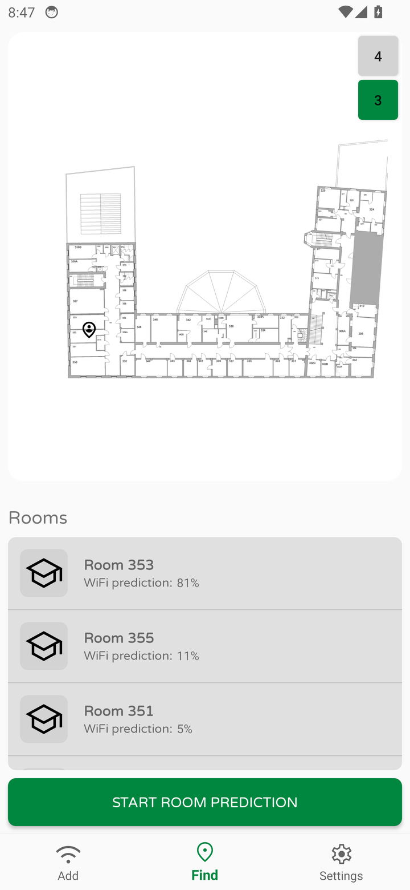
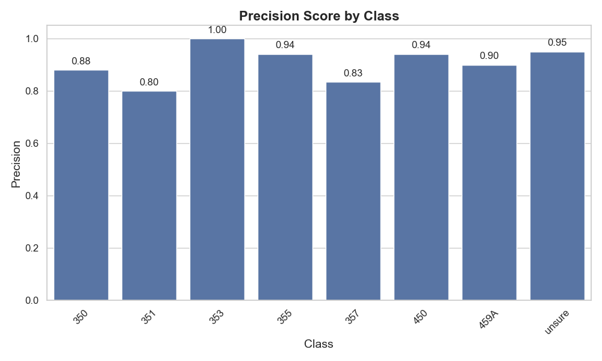

# IntelliTrack — Indoor-Ortung per WiFi-Fingerprinting und Machine Learning

**Wo bin ich im Gebäude, wenn GPS nicht funktioniert?** IntelliTrack sagt den Raum, in dem sich ein Smartphone befindet, allein aus den empfangenen WLAN-Signalstärken vorher — als Grundlage für Indoor-Navigation über einen Gebäudeplan, z. B. in Unikliniken, Universitäten oder öffentlichen Gebäuden.

*Das Dashboard der App: Gebäudeplan mit Positions-Marker und Stockwerkswahl, darunter die Raumliste mit den Vorhersage-Wahrscheinlichkeiten.*

| | |
|---|---|
| Kontext | Praktikum Intelligent Interactive Systems, LMU München, WiSe 2023/24 · 4-köpfiges Team |
| Rolle | Android-App: Dashboard mit Gebäudeplan (Marker, Stockwerkswechsel) und WLAN-Scan-Ansicht |
| Ergebnis | **92 % Raum-Vorhersagegenauigkeit** (XGBoost, 5-fach-Kreuzvalidierung) |
| Bericht | [Paper als PDF](intellitrack-paper.pdf) (ACM-Format) |

## Die Idee

Im Praktikum Intelligent Interactive Systems haben wir uns im Team der Indoor-Ortung angenommen und das Ergebnis als ACM-Paper dokumentiert. Der Kern der Idee: GPS fällt in Gebäuden aus, aber WLAN-Netze sind fast überall — und ihre Signalstärken bilden pro Raum ein charakteristisches Muster, einen „Fingerprint“, den ein Machine-Learning-Modell wiedererkennen kann.

## Wie es funktioniert

1. **Datensammlung:** Eine eigene Android-App scannt in festen Intervallen alle empfangbaren WLAN-Netze und erfasst Signalstärke (dBm), SSID/BSSID, Frequenz und Kanalbreite — geloggt in verschiedenen Räumen samt angrenzenden Außenbereichen, mit randomisierten Bewegungsmustern gegen Verzerrung.
2. **Preprocessing:** Normalisierung der Signalstärken, Ausreißer-Filterung, Feature-Extraktion und Dimensionsreduktion. Ein zentraler Befund dabei: 5-GHz-Netze liefern deutlich konsistentere Daten und trennen Räume besser als 2,4 GHz.
3. **Modellvergleich:** Decision Tree als Baseline (80,8 %), Random Forest (86,4 %), XGBoost (92,0 %) — jeweils mit 5-fach-Kreuzvalidierung evaluiert; Hyperparameter-Tuning per GridSearch.

*Precision pro Raum-Klasse des besten Modells (XGBoost) — Abbildung aus dem Paper.*

## Mein Beitrag

Das Frontend des Systems ist eine Android-App (Kotlin), an der ich einen der beiden Hauptanteile hatte (20 von 44 Commits):

- **Dashboard mit interaktivem Gebäudeplan:** Kartenansicht mit Positions-Markern und Stockwerkswechsel — die Ansicht, auf der die vorhergesagte Raumposition angezeigt wird
- **WLAN-Scan-Ansicht:** Listen-Adapter, die die laufenden WLAN-Scans und erkannten Räume anzeigen
- **Aufbau und Styling:** die Oberflächen der App-Ansichten (Fragmente)

## Technologien

| Ebene | Eingesetzt |
|---|---|
| App | Android (Kotlin) |
| Machine Learning | Python · XGBoost · Random Forest · Decision Trees · Feature Engineering · Kreuzvalidierung, GridSearch |
| Dokumentation | wissenschaftliches Schreiben (ACM-Paper, LaTeX) |
