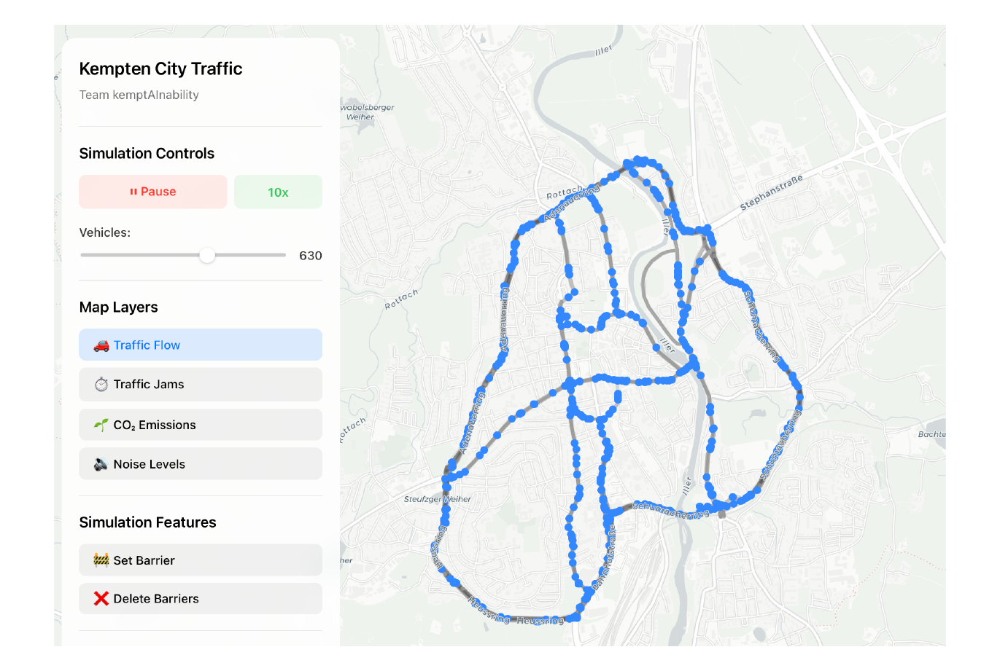
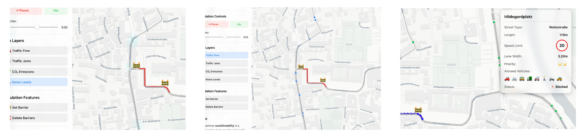

# kemptAInability — interaktive Verkehrsfluss-Simulation für Kempten (Teamprojekt)

**Was passiert mit dem Verkehr einer Stadt, wenn ihre wichtigste Brücke gesperrt wird?** kemptAInability macht das erlebbar: eine interaktive Verkehrssimulation für Kempten, in der Bürger:innen und Stadtplaner:innen Straßen per Fingertipp sperren und sofort sehen, wie sich Verkehrsfluss, Stau, Lärm und CO₂-Emissionen verändern — entwickelt rund um die real geplante Sperrung der St.-Mang-Brücke.

| | |
|---|---|
| Kontext | sustAInability-Seminar, Hochschule München + TU München, 2025 · 4-köpfiges Team |
| Rolle | Die komplette Datenpipeline: OSM-Extraktion → Bereinigung → SUMO-Netz → GeoJSON · Co-Autor des Reports |
| Code | [fio-la/Sustainable_Mobility](https://github.com/fio-la/Sustainable_Mobility) (öffentlich) |
| Bericht | **[Paper als PDF](kemptainability-paper.pdf)** |

## Die Idee

Im sustAInability-Seminar (Hochschule München + TU München) haben wir im vierköpfigen Team ein KI-Projekt zum Thema nachhaltige Mobilität entwickelt und wissenschaftlich dokumentiert. Unser Aufhänger war konkret und real: die geplante Sperrung der St.-Mang-Brücke in Kempten und die Frage, wie man ihre Folgen für Bürger:innen greifbar macht.

Professionelle Verkehrssimulationen (SUMO, Vissim) sind für Laien unzugänglich. kemptAInability übersetzt sie in ein zugängliches Werkzeug: eine Karte der Stadt, auf der man Szenarien wie die Brückensperrung durchspielt und die Auswirkungen als Heatmaps (Stau, Lärm, CO₂) direkt sieht — mit Gamification-Elementen, die nachhaltige Verkehrskonfigurationen belohnen. Eingebettet in den UN-Nachhaltigkeitsrahmen (SDG 11: Nachhaltige Städte und Gemeinden).

## Technischer Aufbau

1. **Daten:** OpenStreetMap-Straßennetz von Kempten via Overpass-Turbo-Queries, bereinigt mit JOSM und eigenen Python-Skripten (osmnx, geopandas, pyproj)
2. **Simulation:** Konvertierung in ein SUMO-Netz (netconvert/netedit) für die Verkehrsmodellierung
3. **Frontend:** SUMO-Daten als GeoJSON in einer React/Vite-App — animierte Verkehrssimulation mit Zeitsteuerung, interaktiver Barrieren-Platzierung, Heatmap-Overlays und Echtzeit-Metriken

## Mein Beitrag: die Datenpipeline

Der Weg von der rohen Karte zur simulierbaren Stadt — alle vier Stufen der Datenaufbereitung:

- **OSM-Extraktion:** Overpass-Turbo-Queries, die gezielt das relevante Straßennetz von Kempten aus OpenStreetMap ziehen
- **Bereinigung:** manuelle Prüfung in JOSM plus Python-Skripte, die Fußwege, Radwege, Ampeln und überflüssige Knoten entfernen
- **SUMO-Netzkonvertierung:** Umwandlung in ein valides SUMO-Verkehrsnetz (`netconvert`, `map.net.xml`) mit Nacharbeit in `netedit`, samt Dokumentation des Workflows im Repo
- **GeoJSON-Aufbereitung:** Konvertierung der SUMO-Netzdaten in das GeoJSON-Format, das das React-Frontend rendert (angepasste `net2geojson`-Skripte, Waypoints-Konvertierung)

Dazu Co-Autor des Projektreports.

## Technologien

React · Vite · GeoJSON · SUMO (Verkehrssimulation) · OpenStreetMap/Overpass · Python (osmnx, geopandas, pyproj) · wissenschaftliches Schreiben
