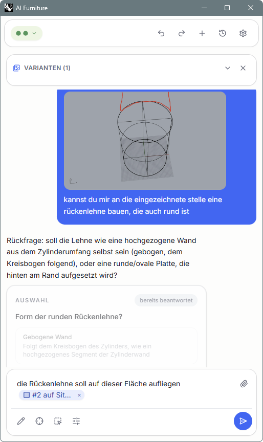
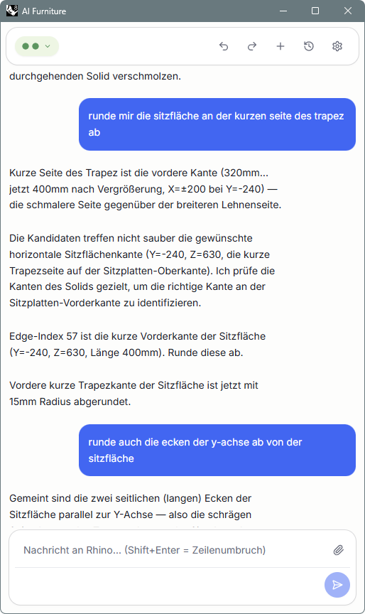
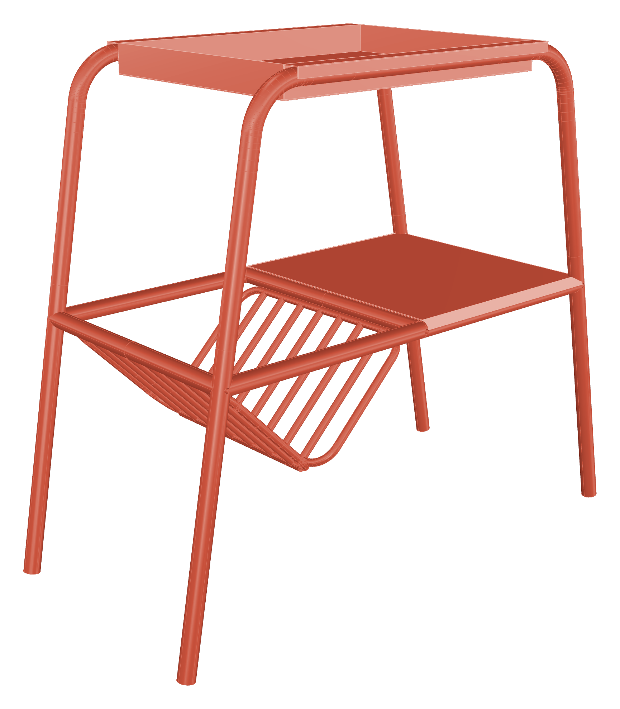
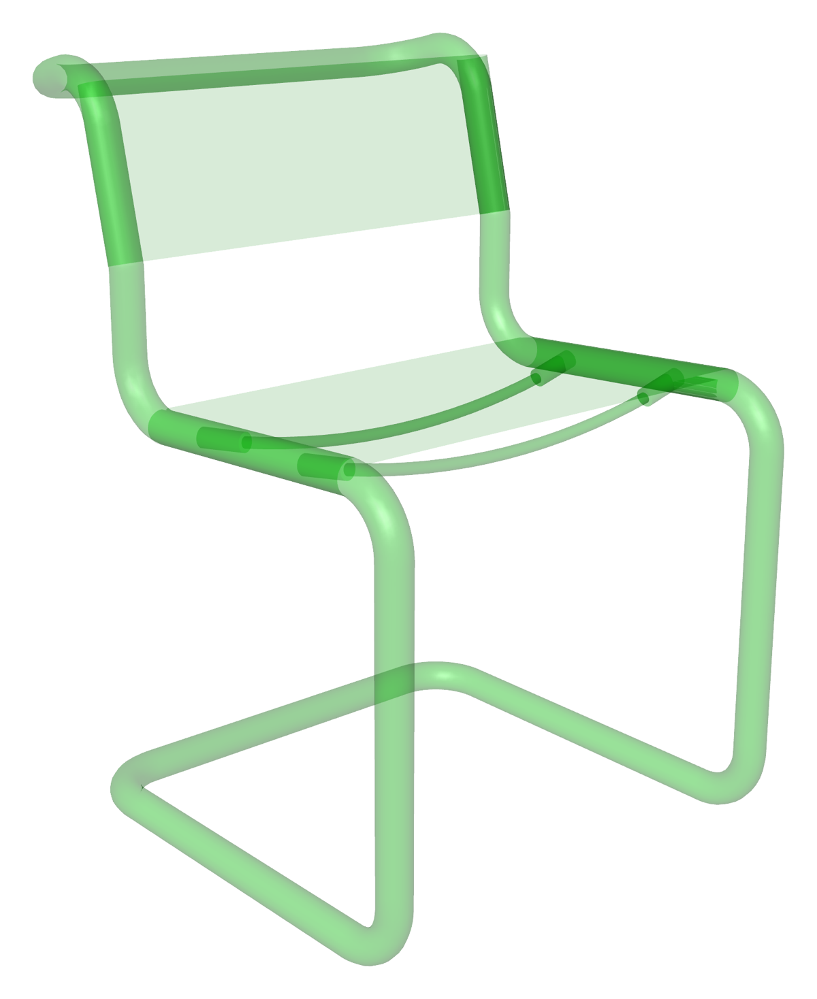
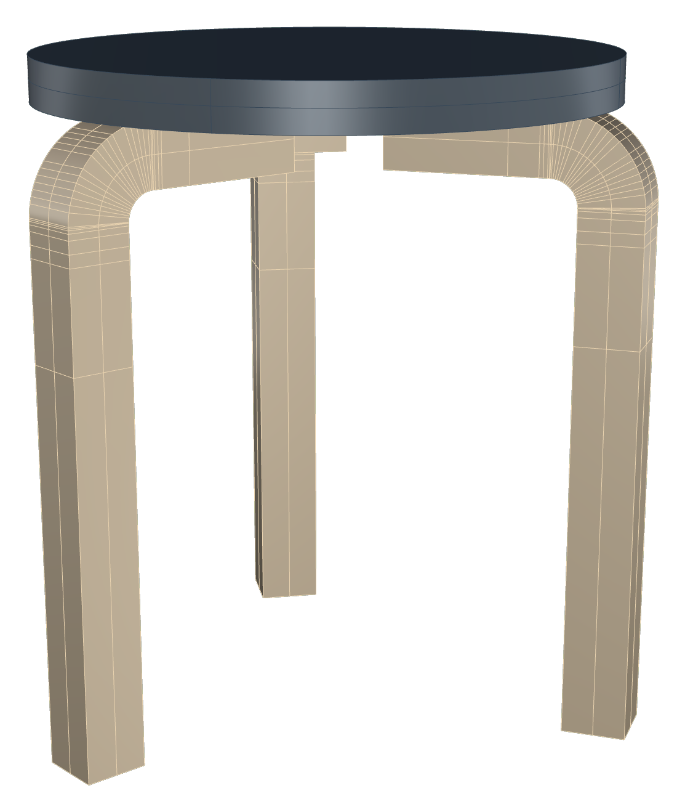
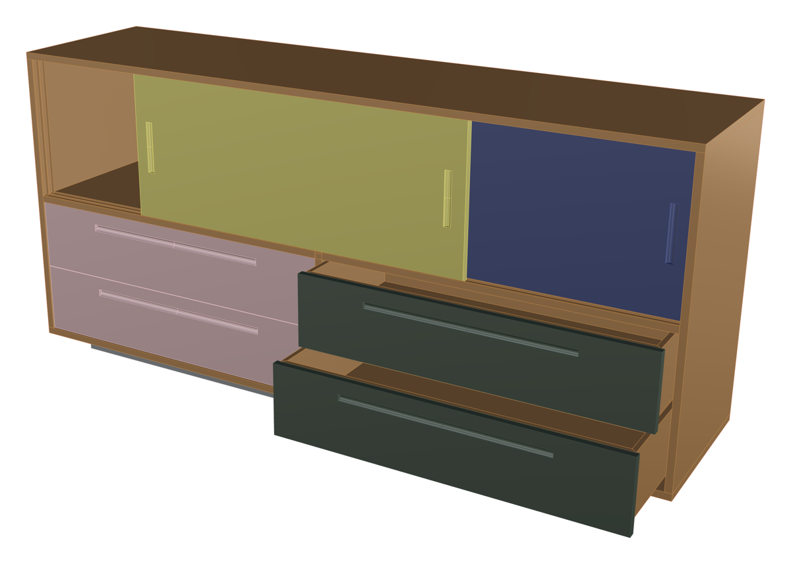

# KI-CAD-Assistent für Rhino 8 — Masterarbeit

**Chatbasierter KI-Assistent, der in Rhino 8 eingebettet ist und Designer:innen 3D-Möbelmodelle über Konversation, visuelle Selektion, Live-Parameter-Slider und Skizzen-Anmerkungen erstellen und bearbeiten lässt.**

| | |
|---|---|
| Kontext | Masterarbeit „Entwerfen mit Künstlicher Intelligenz: Ein KI-gestützter Workflow für den iterativen Möbelentwurf", M.Sc. Medieninformatik, LMU München (Kooperation TUM Architekturinformatik) |
| Zeitraum | März – August 2026 |
| Rolle | Eigenständige Konzeption, Entwicklung, Studiendurchführung und Auswertung (Solo-Projekt) |
| Code | **[Piibo/rhino-ai-cad-assistant](https://github.com/Piibo/rhino-ai-cad-assistant)** — kuratierte Code-Basis (MCP-Server + Studien-Plugin), MIT-lizenziert. Das Arbeits-Repository bleibt privat, weil es Studiendaten enthält. |

*Das Chat-Panel: Eine Skizze auf der Viewport-Aufnahme markiert, wo die Rückenlehne hin soll; die KI stellt eine Rückfrage mit Auswahl-Dialog; im Eingabefeld referenziert ein Chip die zuvor angeklickte Fläche.*

## Problem

Reine Prompt-Werkzeuge degradieren Designer:innen zu Zuschauern: Räumliche Absichten lassen sich sprachlich nur schwer präzise vermitteln („das linke hintere Bein, etwas geschwungener…"). Metrische Angaben funktionieren im Chat robust — lokale, zeigende und richtungsbezogene Bezüge brauchen dagegen sichtbare Selektion, Markierung, Vorschau und Parameter. Die Arbeit untersucht, welche Interaktionswerkzeuge ein chatbasierter KI-CAD-Assistent braucht, damit aus passivem Prompten aktive Modellinteraktion wird.

## Lösung

Ein Rhino-8-Plugin mit zwei Prozessen: ein **FastAPI-Backend, das direkt im Python-Prozess von Rhino läuft**, und ein **React-Frontend im Browser**, verbunden über WebSocket (Streaming) und REST. Das Backend implementiert einen vollständigen **Agent-Loop auf der Anthropic API**: Streaming, 108 Tool-Definitionen, Tool-Dispatch in den Rhino-UI-Thread, Verlaufs-Management und Fehlerbehandlung.

Die Human-in-the-Loop-Werkzeuge, um die es in der Studie ging:

- **Referenz-Picks:** Geometrie anklicken statt beschreiben
- **Live-Parameter-Slider** mit Undo-sicherer Änderungsbündelung
- **Varianten-Galerien** zum Vergleichen von Entwurfsalternativen
- **Skizzen-Overlays** auf Multi-View-Viewport-Aufnahmen
- **Bestätigungs- und Auswahldialoge** für kontrollierte KI-Aktionen

Dazu eine vollständige **Studieninfrastruktur**: zwei Experimentalbedingungen (nur Chat vs. Chat + Werkzeuge), über eine einzige fail-closed Registry-Funktion getrennt; lückenloses Event-Logging in SQLite (12 Tabellen); Export-Bundles mit Manifest und Hash-Validierung; „Golden Hashes", die System-Prompt und Tool-Surface gegen ungewollte Änderungen während der Studie einfrieren.

## Nutzerstudie & Ergebnis

*Zum Vergleich die `basis`-Bedingung der Studie: gleiche CAD-Kompetenz des Assistenten, aber nur Chat — Absichten müssen rein sprachlich vermittelt werden. Der Kontrast zwischen beiden Bedienformen ist der Kern des Studiendesigns.*

Within-subjects-Studie mit **8 Teilnehmenden (16 Sitzungen)**: Jede Person löste Möbelentwurfsaufgaben in beiden Bedingungen. Die Auswertung (codebuchgestützte thematische Analyse: 124 Episoden, 76 Codes, fünf Themen) mündete in ein **empirisch begründetes Interaktions- und Werkzeugmodell** für chatbasierte KI-CAD-Unterstützung — der wissenschaftliche Beitrag der Arbeit.

Zur Studieninfrastruktur gehörten außerdem Counterbalancing-Logik, Consent-Flow und Fragebogen-Instrumente (u. a. Creativity Support Index) im Plugin selbst sowie eine lokale, datenschutzkonforme Transkriptionspipeline (faster-whisper, offline) und ~4.600 Zeilen Auswertungsskripte.

## Technologien

| Ebene | Eingesetzt |
|---|---|
| Frontend (~13.800 Zeilen TS) | React 19 · TypeScript · Vite · Zustand · Tailwind CSS · Radix UI |
| Backend (~30.700 Zeilen Python) | Python · FastAPI · WebSockets · SQLite · Anthropic API (Streaming + Tool-Use) |
| CAD | Rhino 8 · RhinoCommon · rhinoscriptsyntax · Grasshopper |
| Testing | pytest (68 Backend-Tests) · Vitest · eigene Validierungsskripte (Export-Bundles, Golden Hashes) |
| Research | Studiendesign (within-subjects, Counterbalancing) · qualitative Interviews · thematische Analyse |

Zusätzlich entstand in der explorativen Phase ein **MCP-Server** (68 CAD-Tools in 8 Modulen, inkl. SubD-Bearbeitung), der Claude mit Rhino und Grasshopper verband — Basis: zwei MIT-lizenzierte Open-Source-Projekte, dokumentiert nachgenutzt und deutlich erweitert.

## Mit dem Assistenten modelliert

Vier Möbel aus den Research-through-Design-Sessions, jeweils im Dialog mit dem Assistenten in Rhino entstanden — von der Nachbildung von Klassikern bis zum eigenen Entwurf:

*Beistelltisch mit Rohrgestell, Zeitschriftenablage und Tablett-Platte.*

*Freischwinger nach Thonet-Vorbild, Hocker nach dem Vorbild des Artek Stool 60, Sideboard mit Schiebetüren.*

<!-- TODO optional, vom Rhino-PC: Parameter-Slider-Panel + Varianten-Galerie als weitere Screenshots -->
