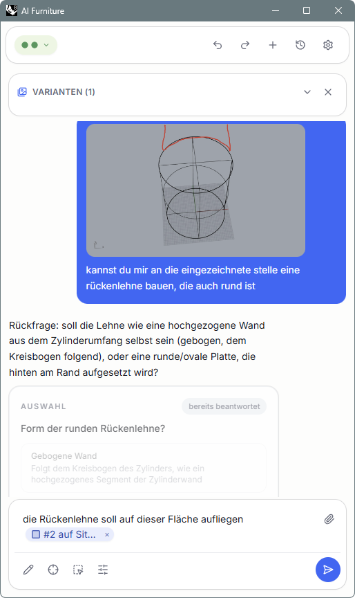
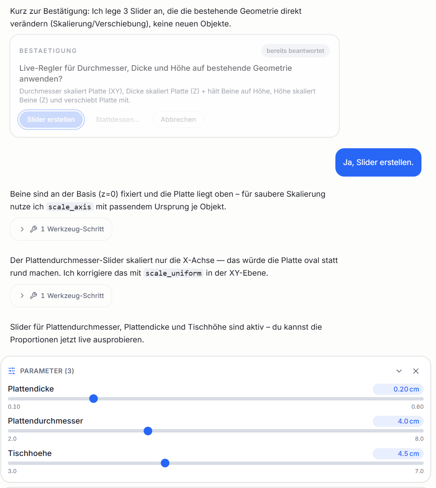
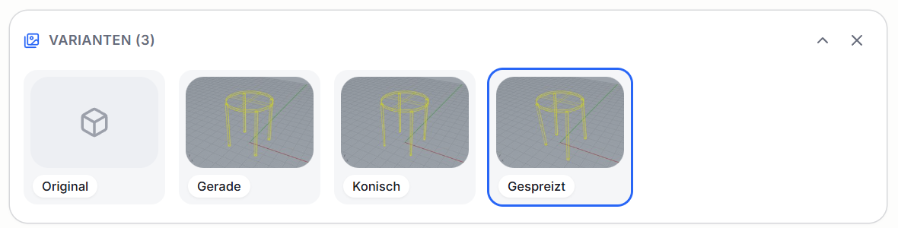
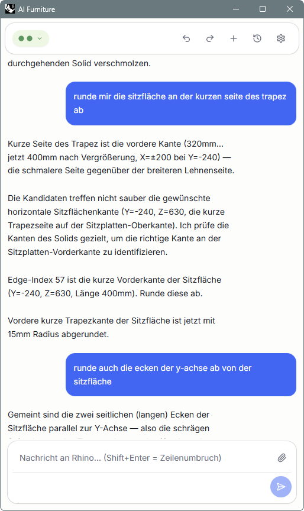
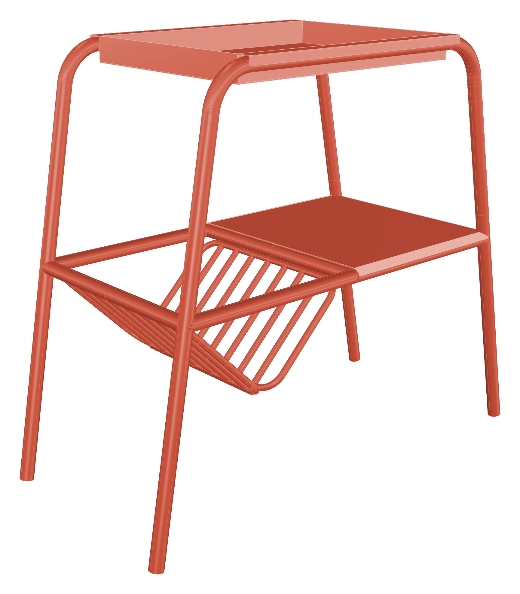
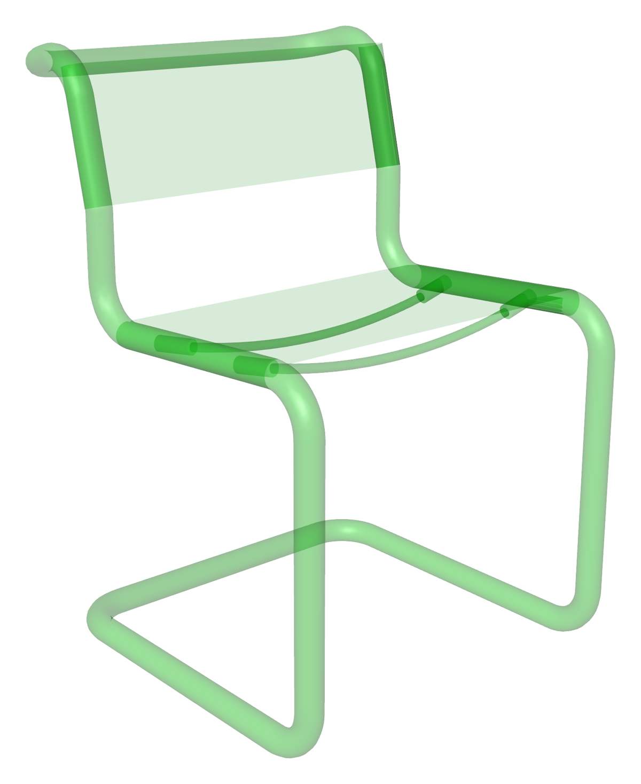
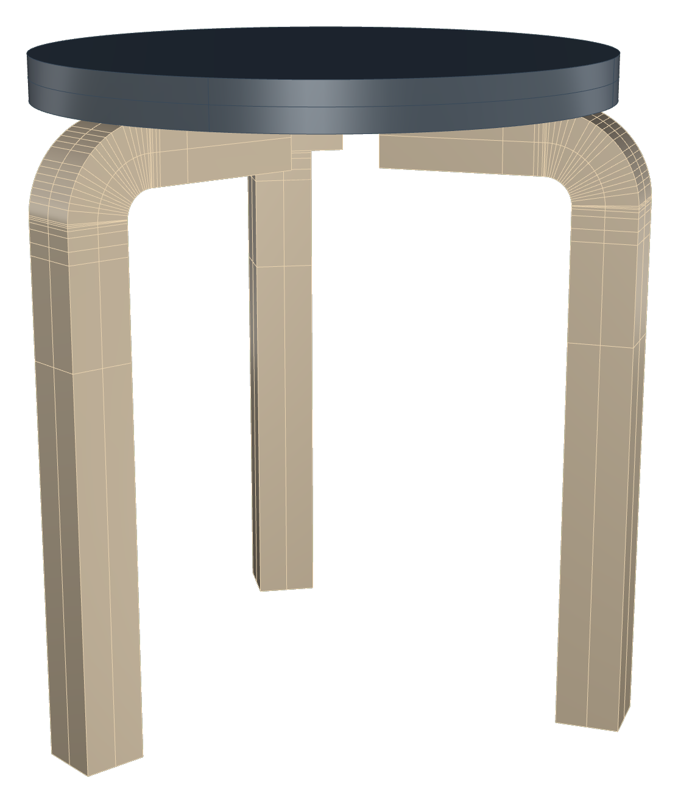
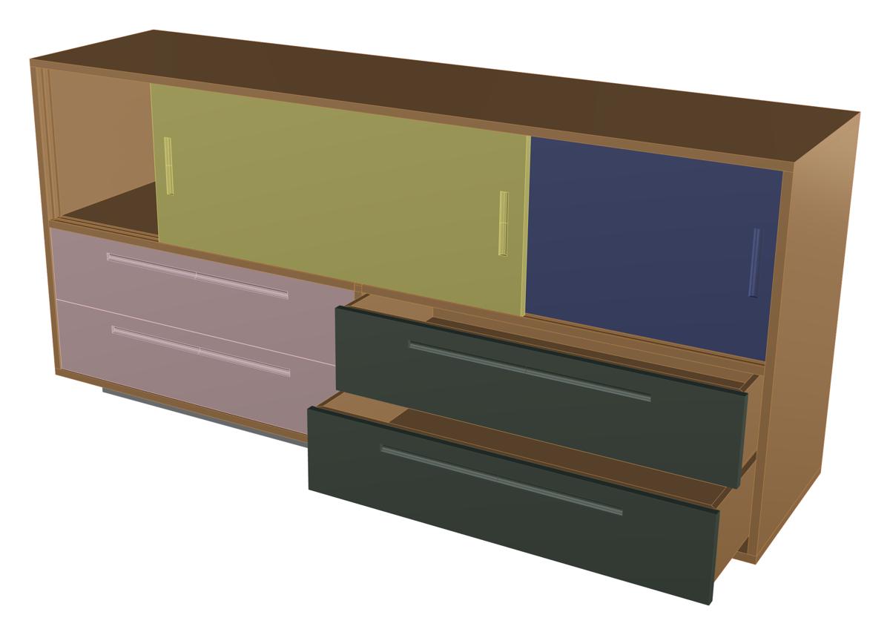

# KI-CAD-Assistent für Rhino 8 — Masterarbeit

**Chatbasierter KI-Assistent, der in Rhino 8 eingebettet ist und Designer:innen 3D-Möbelmodelle über Konversation, visuelle Selektion, Live-Parameter-Slider und Skizzen-Anmerkungen erstellen und bearbeiten lässt.**

*Das Chat-Panel: Eine Skizze auf der Viewport-Aufnahme markiert, wo die Rückenlehne sitzen soll; die KI stellt eine Rückfrage mit Auswahldialog; im Eingabefeld referenziert ein Chip die zuvor angeklickte Fläche.*

▶️ **[Demo-Video auf YouTube](https://youtu.be/Qb64zsemRec)**

| | |
|---|---|
| Kontext | Masterarbeit „Entwerfen mit Künstlicher Intelligenz: Ein KI-gestützter Workflow für den iterativen Möbelentwurf“, M.Sc. Medieninformatik, LMU München, März bis August 2026 (Kooperation TUM Architekturinformatik) |
| Rolle | Konzeption, Entwicklung, Studie und Auswertung |
| Code | [Piibo/rhino-ai-cad-assistant](https://github.com/Piibo/rhino-ai-cad-assistant) — kuratierte Code-Basis (MCP-Server + Studien-Plugin), MIT-lizenziert. Das Arbeits-Repository bleibt privat, weil es Studiendaten enthält. |

## Die Fragestellung

Reine Prompt-Werkzeuge degradieren Designer:innen zu bloßen Zuschauenden: Räumliche Absichten lassen sich sprachlich nur schwer präzise vermitteln („das linke hintere Bein, etwas geschwungener …“). Metrische Angaben funktionieren im Chat robust — lokale, zeigende und richtungsbezogene Bezüge brauchen dagegen sichtbare Selektion, Markierung, Vorschau und Parameter. Die Arbeit untersucht, welche Interaktionswerkzeuge ein chatbasierter KI-CAD-Assistent braucht, damit aus passivem Prompten aktive Modellinteraktion wird.

## Der Prototyp

Ein Rhino-8-Plugin aus zwei Teilen: ein **Python-Backend (FastAPI), das direkt in Rhino läuft**, und eine **Chat-Oberfläche in React**, verbunden über WebSocket. Das Backend lässt das Sprachmodell (Anthropic API) in einer Schleife arbeiten: Das Modell wählt aus **108 Werkzeugen** — etwa einen Regler anlegen oder Varianten zeigen —, das Plugin führt sie in Rhino aus und meldet das Ergebnis zurück, bis die Anfrage erledigt ist.

Die Human-in-the-Loop-Werkzeuge, um die es in der Studie ging:

- **Referenzen per Klick:** Geometrie anklicken statt beschreiben
- **Live-Regler:** Maße direkt am Modell verändern; eine Reglerbewegung lässt sich in einem Schritt rückgängig machen
- **Variantengalerien:** Entwurfsalternativen nebeneinander vergleichen
- **Skizzen:** auf Aufnahmen des Modells aus mehreren Ansichten zeichnen
- **Bestätigungs- und Auswahldialoge:** KI-Aktionen kontrolliert freigeben

*Der Slider-Workflow an einem Beistelltisch: Vor dem Eingriff fragt der Assistent per Bestätigungsdialog nach, korrigiert beim Umsetzen einen eigenen Fehler (achsweise vs. gleichmäßige Skalierung) sichtbar im Chat — und am Ende stehen drei Live-Regler, die die Geometrie direkt in Rhino verändern.*

*Die Variantengalerie: drei Beinform-Alternativen (gerade, konisch, gespreizt) als Viewport-Aufnahmen zum Durchschalten — die gewählte Variante wird im Modell aktiv.*

Die Studie steckt im Plugin selbst: Eine einzige Stelle im Code schaltet zwischen den beiden Bedingungen um (nur Chat oder Chat mit Werkzeugen), jede Aktion wird in einer Datenbank protokolliert, und eine Prüfsumme stellt sicher, dass sich Anweisungen und Werkzeuge des Assistenten während der Studie nicht unbemerkt ändern.

In der Anfangsphase entstand außerdem ein **MCP-Server**, über den das Sprachmodell Claude Rhino und Grasshopper direkt bedienen konnte. Er baut auf zwei MIT-lizenzierten Open-Source-Projekten auf; die Werkzeugmodule sind neu implementiert und um eine eigene SubD-Schicht ergänzt.

## Die Studie

*Zum Vergleich die `basis`-Bedingung der Studie: gleiche CAD-Kompetenz des Assistenten, aber nur Chat mit Text und Bildanhang — ohne Klick, Regler und Skizze. Der Kontrast zwischen beiden Bedienformen ist der Kern des Studiendesigns.*

Studie mit **8 Teilnehmenden in 16 Sitzungen**: Jede Person löste Möbelentwurfsaufgaben in beiden Bedingungen. Ausgewertet habe ich die Sitzungen mit einer thematischen Analyse. Daraus entstand ein Modell dafür, wann ein chatbasierter KI-CAD-Assistent welche Werkzeuge braucht — der wissenschaftliche Beitrag der Arbeit.

Einwilligung und Fragebögen waren ins Plugin eingebaut; die Gespräche wurden lokal und offline transkribiert.

## Mit dem Assistenten modelliert

Vier Möbel aus den Research-through-Design-Sessions, jeweils im Dialog mit dem Assistenten in Rhino entstanden — von der Nachbildung von Klassikern bis zum eigenen Entwurf:

*Beistelltisch mit Rohrgestell, Zeitschriftenablage und Tablett-Platte.*

*Freischwinger nach Thonet-Vorbild, Hocker nach dem Vorbild des Artek Stool 60, Sideboard mit Schiebetüren.*

## Technologien

| Ebene | Eingesetzt |
|---|---|
| Frontend (~13.800 Zeilen TS) | React 19 · TypeScript · Vite · Zustand · Tailwind CSS · Radix UI |
| Backend (~30.700 Zeilen Python) | Python · FastAPI · WebSockets · SQLite · Anthropic API (Streaming + Tool-Use) |
| CAD | Rhino 8 · RhinoCommon · rhinoscriptsyntax · Grasshopper |
| Tests | pytest (68 Backend-Tests) · Vitest · eigene Prüfskripte |
| Studie | Studiendesign (Within-Subjects) · qualitative Interviews · thematische Analyse |
