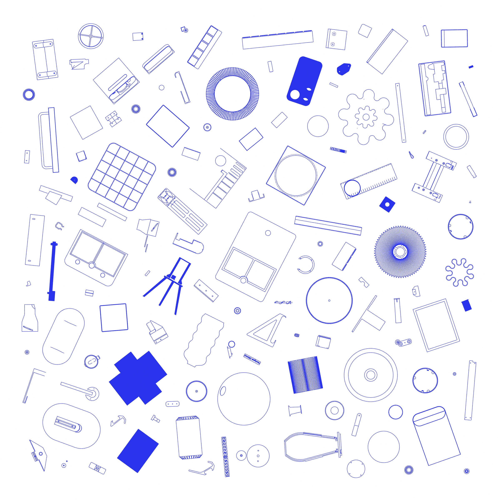

# Konstruktionen — 143 Teile aus Fusion 360

**Seit November 2024 konstruiere ich in Fusion 360 Teile nach Maß und drucke sie selbst: Halter, Leuchtenteile, Beschläge, Ersatzteile.** Das Bild zeigt 129 davon von oben, alle im selben Maßstab.

*Alle 129 Teile im richtigen Größenverhältnis zueinander, von oben gesehen. Gerendert aus den STEP-Exporten der Fusion-Designs.*

| | |
|---|---|
| Kontext | Eigene Projekte und Uni-Prototypen, seit November 2024 |
| Rolle | Konstruktion und Druck |
| Umfang | 143 Teile (Fusion-Designs) mit zusammen 508 gespeicherten Versionen; 34 davon haben mindestens 5 Versionen, 12 mindestens 10 (Stand 09/2026) |

## Was drin ist

- **Leuchten und Leuchtenteile:** Lampenschirme, eine Leuchte mit Kühlkörper, das Gerüst für eine Reispapier-Leuchte, LED-Halter, eine LED-Leiste mit Touch-Gehäuse, ein Ersatz-Drehknopf und eine Halterung für Artemide-Leuchten
- **Halter nach Maß:** für Audio-Interface, Router, Haarschneider und Kabel, unter dem Schreibtisch, am USM-Möbel oder an der Wand
- **Wand und Möbel:** ein French-Cleat-Wandsystem, eine Halterung für einen Balkontisch (26 Versionen), Möbelgriffe, eine Bohrlehre für Griffe, ein Kabelhalter fürs Vitsoe-Regal, Rahmen für Jalousie- und Lichtschalter
- **Ordnung:** Gridfinity-Einsätze, zum Beispiel für einen Messschieber (10 Versionen)
- **Uni-Prototypen:** Getriebe, Achsen und Trichter von [SpAice](../spice-dispenser/) (das Verbindungsstück allein in 29 Versionen), der Lampenkopf von [Bloomie](../bloomie/)
- **Sonstiges:** ein Geländerelief vom Hochgrat, eine Wanduhr, eine Pflanzenanzucht

Einige wenige Teile sind Remixe fremder Modelle, die ich angepasst habe.

## Wie das Bild entstanden ist

Die Designs lagen als STEP-Exporte vor. Ein Python-Skript wandelt sie in Meshes um (cascadio, trimesh), legt jedes Teil auf seine größte Fläche und verteilt alle ohne Überlappung auf der Zeichenfläche, jedes in einem zufälligen Winkel. Blender zeichnet daraus die sichtbaren Kanten als Linien (Freestyle). Zwölf Designs bestehen nur aus Mesh-Körpern und fehlen deshalb im Bild; zwei weitere habe ich weggelassen.

## Technologien

| Ebene | Eingesetzt |
|---|---|
| Konstruktion | Fusion 360 · Add-ins Gridfinity Generator und Helical Gear Generator |
| Druck | Bambu Studio · Bambu Lab A1 mit AMS · PLA, PETG, ASA |
