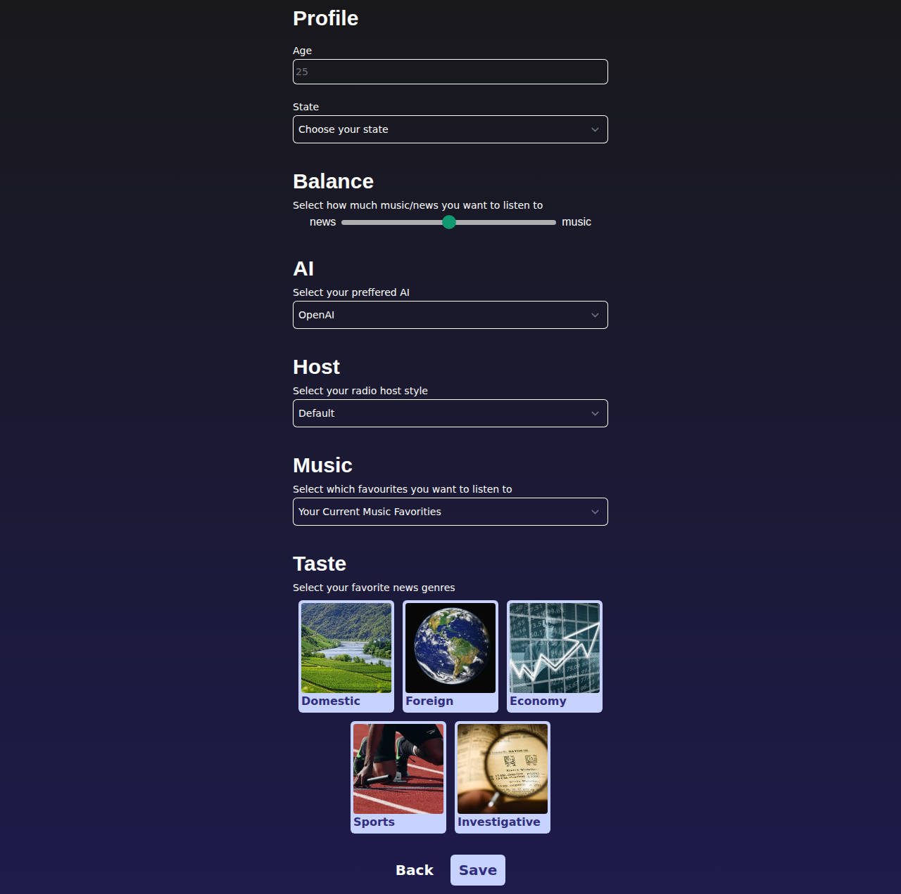

# Nüslify — dein persönliches KI-Radio (Teamprojekt)

**Ein Radiosender, der nur für dich sendet:** Nüslify holt per KI aktuelle Nachrichten zu deinen Interessen, bereitet sie auf und mischt sie mit deiner eigenen Spotify-Musik — wie ein klassisches Radioprogramm aus Moderation und Musik, nur eben personalisiert auf Interessen und Hörgewohnheiten.

| | |
|---|---|
| Kontext | Kurs Intelligent User Interfaces (IUI), LMU München, WiSe 2023/24 · 5-köpfiges Team |
| Rolle | Frontend: Interessen-Feature (UI bis Datenbank) und Teile des Player-Dashboards |
| Code | [NoelHuibers/nueslify](https://github.com/NoelHuibers/nueslify) (öffentlich, GPL-3.0) |
| Demo | [nueslify.vercel.app](https://nueslify.vercel.app) (läuft; zum Ausprobieren ist ein Spotify-Login nötig) |

## Der Kurs und die Idee

Im Kurs Intelligent User Interfaces entwirft und baut jedes Team über das Semester ein lauffähiges intelligentes Interface — bei uns eine Web-App, die KI nicht als Gimmick, sondern als Kern des Nutzungserlebnisses einsetzt.

Radio lebt von der Mischung aus Information und Musik — aber das Programm bestimmt der Sender. Nüslify dreht das um: Die News kommen KI-kuratiert zu den Themen, die dich interessieren, die Musik kommt aus deinem eigenen Spotify-Account. Umgesetzt als Progressive Web App, die sich wie eine native App nutzen lässt.

## Mein Beitrag

*Das Interessen-Feature — mein Hauptbeitrag: Profil, News↔Musik-Balance, KI- und Host-Auswahl, Musik-Favoriten und die Genre-Kacheln für die News-Personalisierung.*

Mein Schwerpunkt lag im Frontend:

- **Das Interessen-Feature von UI bis Datenbank:** die Seiten und Formulare, mit denen Nutzer:innen ihre Themeninteressen auswählen (React/Next.js), samt Styling, tRPC-API-Router und Anbindung an das Drizzle-Datenbankschema — die Grundlage für die personalisierte News-Auswahl
- **Teile des Player-Dashboards:** News-Player als eigenständige Komponente herausgelöst und gestylt, Spotify-Button, Navbar-Styling, Ladezustände

## Technologien

| Ebene | Eingesetzt |
|---|---|
| Web-App | Next.js · TypeScript · tRPC · Tailwind CSS (T3-Stack), als PWA |
| Daten | Drizzle ORM · SQL (PlanetScale) |
| Integrationen | Spotify-API (Login via NextAuth) · LangChain mit wählbarem Modell (OpenAI GPT / Google Gemini) für die News-Aufbereitung · AWS S3 |
| Betrieb | Vercel (Live-Deployment) |
