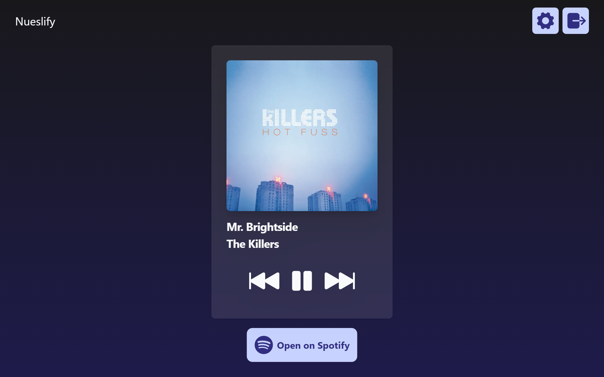
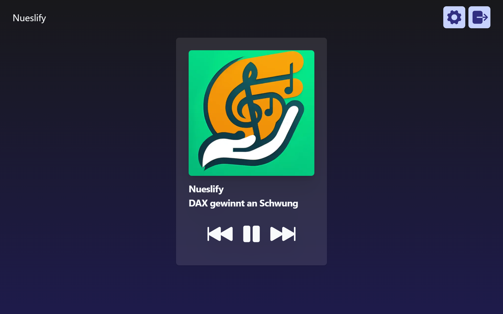
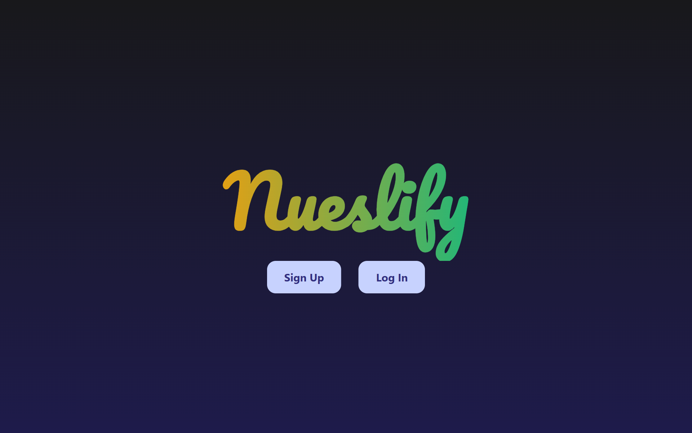
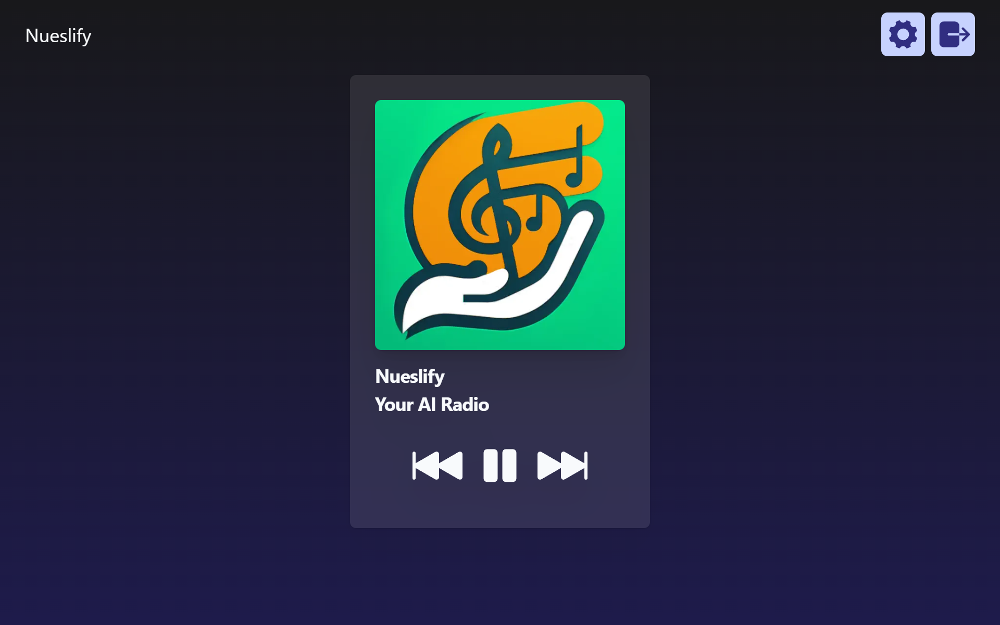
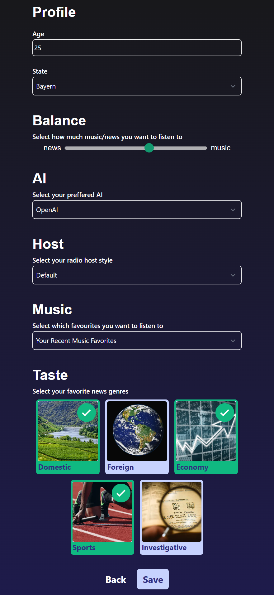

# Nüslify: persönliches KI-Radio

**Ein Radioprogramm für eine einzige Person:** Nüslify holt per KI aktuelle Nachrichten zu den Interessen der Hörer:innen, bereitet sie auf und mischt sie mit ihrer Spotify-Musik. Moderation und Musik wie im klassischen Radio, nur personalisiert.

*Das Dashboard im Browser: Links läuft Musik aus dem eigenen Spotify-Konto, rechts ist Nüslify mit den Nachrichten an der Reihe, hier mit einer Schlagzeile aus der Wirtschaft.*

| | |
|---|---|
| Kontext | Kurs Intelligent User Interfaces, LMU München, WiSe 2023/24 · 5-köpfiges Team |
| Rolle | Interessen-Feature durchgängig von der Oberfläche bis zur Datenbank, dazu Teile des Player-Dashboards |
| Code | [NoelHuibers/nueslify](https://github.com/NoelHuibers/nueslify) (öffentlich, GPL-3.0) |
| Deployment | Lief als PWA auf Vercel (nueslify.vercel.app); die Anmeldung über Spotify funktioniert inzwischen nicht mehr (Stand 09/2026) |

## Die Idee

Im Kurs Intelligent User Interfaces haben wir im Team eine Web-App gebaut und veröffentlicht, in der KI den Kern des Nutzungserlebnisses bildet.

Radio lebt von der Mischung aus Information und Musik, aber das Programm bestimmt der Sender. Nüslify dreht das um: Die News kommen KI-kuratiert zu selbst gewählten Themen, die Musik aus dem eigenen Spotify-Account. Umgesetzt als Progressive Web App, die sich wie eine native App nutzen lässt.

## Wie es funktioniert

1. **Anmelden und einstellen:** Man meldet sich mit Spotify an und legt Alter und Bundesland fest, dazu das Verhältnis von Musik und Nachrichten, das KI-Modell, den Moderationsstil, welche Lieblingssongs laufen und welche Nachrichtenthemen interessieren.
2. **Nachrichten holen:** Ein regelmäßiger Job lädt aktuelle Meldungen der Tagesschau, von Inland bis Sport.
3. **Moderieren:** Ein Sprachmodell, wahlweise GPT von OpenAI oder Gemini von Google, fasst passende Meldungen zusammen und schreibt Begrüßung und Überleitungen. Eine KI-Stimme liest sie vor.
4. **Musik dazwischen:** Zwischen den Moderationen spielt die App Songs aus den eigenen Spotify-Lieblingstiteln, direkt im Browser (dafür braucht man Spotify Premium).

*Links die Startseite mit der Anmeldung über Spotify. Rechts der Start des Programms: Nüslify spricht die Begrüßung, der Player zeigt „Your AI Radio“.*

## Mein Beitrag

- **Das Interessen-Feature:** die Seiten und Formulare, auf denen Nutzer:innen ihr Profil anlegen und festlegen, welche News-Themen sie interessieren, welchen Anteil News und Musik haben, welches KI-Modell und welcher Moderationsstil die News aufbereiten und welche Musik sie mögen (React/Next.js), samt Styling, tRPC-API-Router und Anbindung an das Drizzle-Datenbankschema, als Grundlage für die personalisierte News-Auswahl
- **Teile des Player-Dashboards:** News-Player als eigenständige Komponente herausgelöst und gestylt, Spotify-Button, Navbar-Styling, Ladezustände

*Die Einstellungsseite, mein Hauptteil: Profil, das Verhältnis von Nachrichten und Musik, KI-Modell, Moderationsstil, welche Lieblingssongs laufen und welche Nachrichtenthemen als Bildkacheln ausgewählt sind.*

## Technologien

| Ebene | Eingesetzt |
|---|---|
| Web-App | Next.js · TypeScript · tRPC · Tailwind CSS (T3-Stack), als PWA |
| Daten | Drizzle ORM · PlanetScale (MySQL), später Turso (SQLite) |
| Integrationen | Spotify (Login über NextAuth, Wiedergabe über das Web Playback SDK) · Tagesschau-API · LangChain mit wählbarem Modell (OpenAI GPT / Google Gemini) · OpenAI-Sprachausgabe · AWS S3 |
| Betrieb | Vercel |
