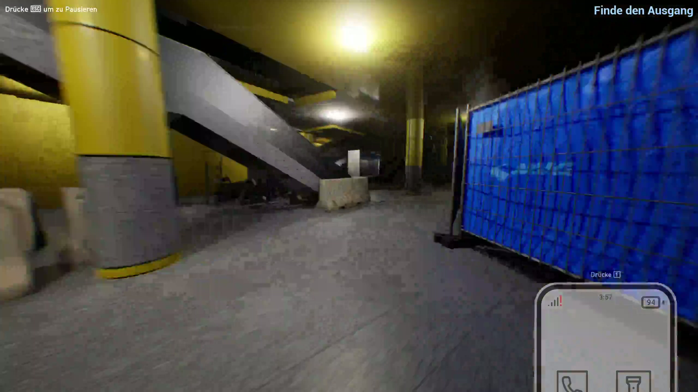
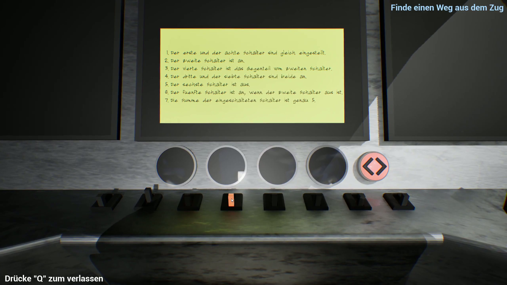
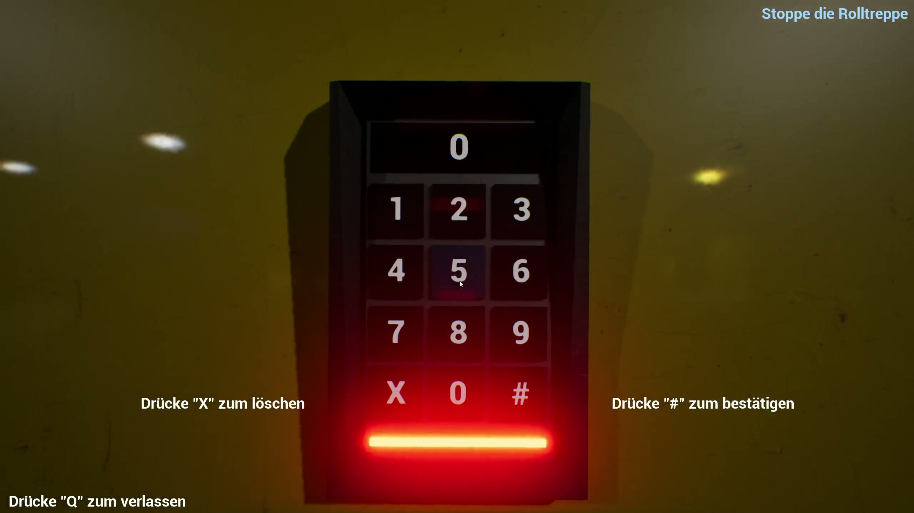

# Sendlingers Escape — Escape-Game in der Unreal Engine (Teamprojekt)

**Ein Escape-Game rund um das Sendlinger Tor in München, entwickelt im dreiköpfigen Team im Praktikum Game Development der LMU München** (In-House-Praktikum des Instituts, ohne Firmenpartner).

▶️ **[Gameplay-Video auf YouTube](https://youtu.be/RlHncoayMY8)**

| | |
|---|---|
| Kontext | Praktikum Game Development, LMU München, SoSe 2024 · 3-köpfiges Team |
| Engine | Unreal Engine |
| Rolle | 3D-Objekt-Arbeit (gesamtes Asset-/Modell-Cleanup) + Design und Umsetzung des ersten Rätsels |

## Das Spiel

Die Spieler:innen wachen in einem U-Bahn-Zug auf und müssen aus der Station Sendlinger Tor entkommen — die Münchner U-Bahn-Umgebung ist als begehbare 3D-Welt im Spiel nachgebaut, vom Zuginneren über Bahnsteige und Rolltreppen bis zu den Technikräumen. Der Weg nach oben führt über eine Kette von Rätseln.

*Die Station als begehbare 3D-Umgebung — Bahnsteig mit den typischen gelben Säulen und blauen Wandkacheln.*

## Mein Beitrag

- **Die 3D-Objekt-Arbeit des Projekts:** Aufbereitung und Cleanup des Stations-Modells und der Spielobjekte, damit sie in der Unreal Engine sauber nutzbar waren — Geometrie bereinigen und spieltauglich machen.
- **Das erste Rätsel:** Konzeption und Umsetzung des Einstiegsrätsels, das die Spieler:innen ins Spiel führt — eine Schaltertafel, deren richtige Stellung sich aus einer Notiz voller verschachtelter Logik-Hinweise ergibt.

*Links: das Einstiegsrätsel — Schalter nach den Logik-Hinweisen der Notiz stellen, um aus dem Zug zu kommen. Rechts: ein späteres Rätsel der Kette (Code-Eingabe am Keypad).*

## Technologien

Unreal Engine · 3D-Modell-Aufbereitung und -Cleanup · Teamarbeit (3-köpfiges Entwicklungsteam)

