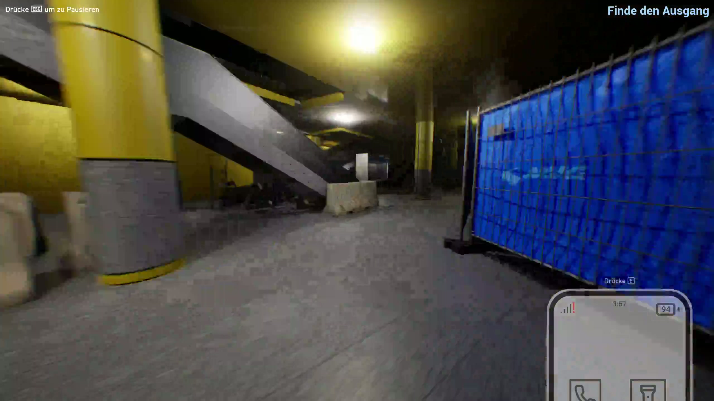
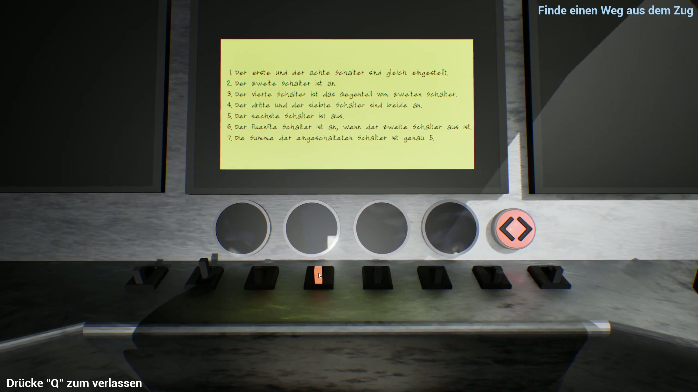
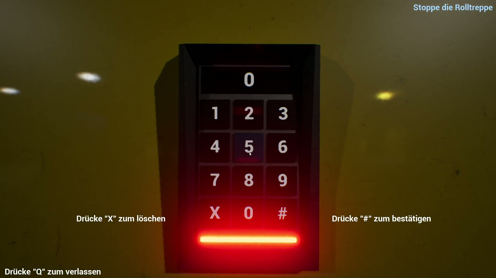

# Sendlingers Escape — Escape-Game in der Unreal Engine

**Ein Escape-Game rund um das Sendlinger Tor in München, entwickelt im Praktikum Game Development der LMU München.**

*Die Station als begehbare 3D-Umgebung. Oben rechts steht die aktuelle Aufgabe, unten rechts das Smartphone, über das die Aufgaben kommen.*

▶️ **[Gameplay-Video auf YouTube](https://youtu.be/RlHncoayMY8)**

| | |
|---|---|
| Kontext | Praktikum Game Development, LMU München, SoSe 2024 · 3-köpfiges Team |
| Rolle | 3D-Objekt-Arbeit (gesamtes Asset-/Modell-Cleanup) · Design und Umsetzung des ersten Rätsels |

## Die Idee

Im Praktikum Game Development haben wir über das Semester ein vollständiges, spielbares Spiel entwickelt — vom Konzept über Level- und Rätseldesign bis zum fertigen Build samt Gameplay-Video. Unsere Wahl: ein Escape-Game an einem realen Münchner Ort.

## Das Spiel

Die Spieler:innen wachen in einem U-Bahn-Zug auf und müssen aus der Station Sendlinger Tor entkommen — die Münchner U-Bahn-Umgebung ist als begehbare 3D-Welt nachgebaut, vom Zuginneren über Bahnsteige und Rolltreppen bis zu den Technikräumen, mit den typischen gelben Säulen und blauen Wandkacheln der echten Station. Die Aufgaben erscheinen auf einem Smartphone im Interface; der Weg nach oben führt über eine Kette von Rätseln: aus dem Zug herausfinden, die Rolltreppe stoppen, in den Technikräumen das Passwort für die Schalträume aufspüren, Codes am Keypad eingeben — bis am Ende die Netzverbindung wiederhergestellt ist und ein Anruf das offene Ende einläutet.

## Mein Beitrag

- **Die 3D-Objekt-Arbeit des Projekts:** Aufbereitung und Cleanup des Stations-Modells und der Spielobjekte, damit sie in der Unreal Engine sauber nutzbar waren — Geometrie bereinigen und spieltauglich machen.
- **Das erste Rätsel:** Konzeption und Umsetzung des Einstiegsrätsels, das die Spieler:innen ins Spiel führt — eine Schaltertafel, deren richtige Stellung sich aus einer Notiz voller verschachtelter Logik-Hinweise ergibt.

*Links: das Einstiegsrätsel — Schalter nach den Logik-Hinweisen der Notiz stellen, um aus dem Zug zu kommen. Rechts: ein späteres Rätsel der Kette (Code-Eingabe am Keypad).*

## Technologien

| Ebene | Eingesetzt |
|---|---|
| Engine | Unreal Engine · Blueprints · C++ |
| 3D | Blender (Aufbereitung und Cleanup der Modelle) |
