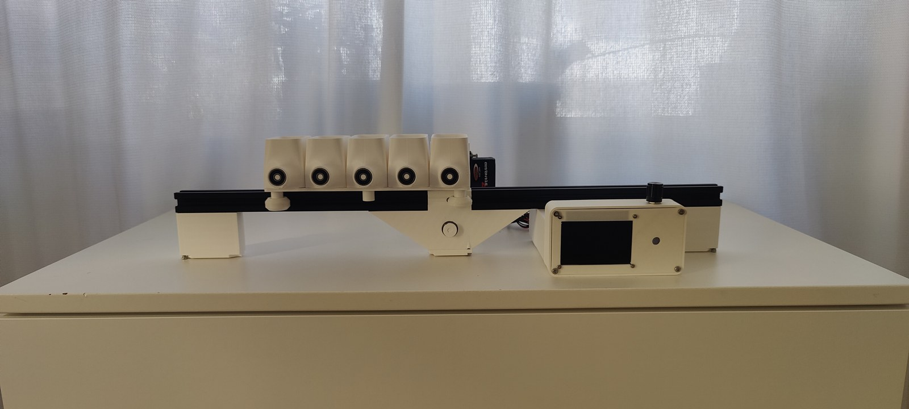
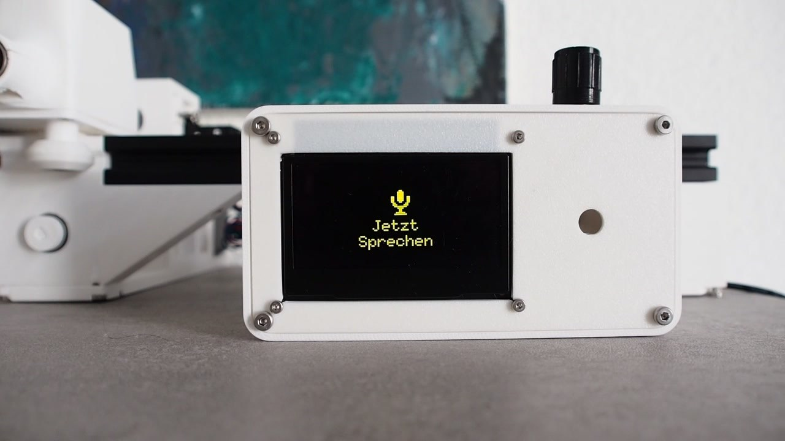
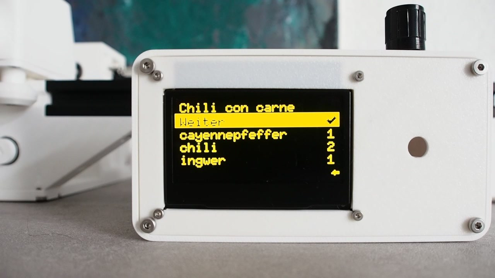
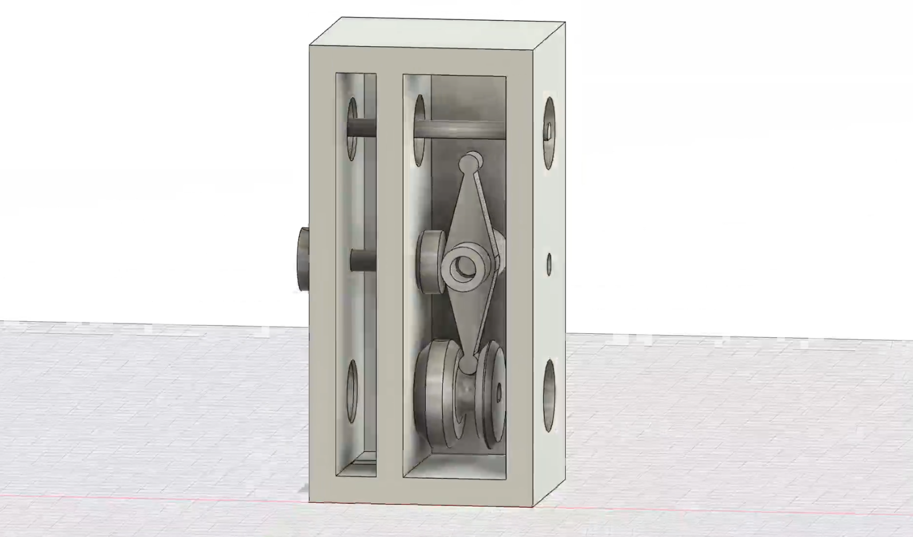
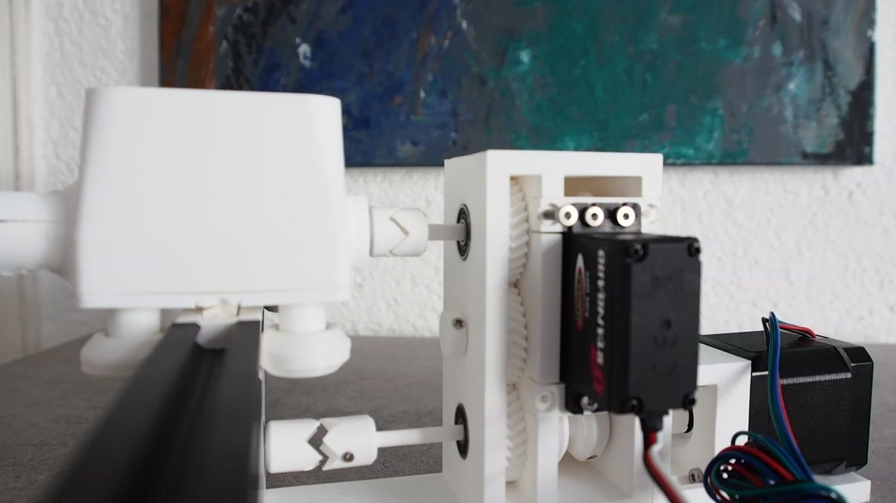

# SpAice — KI-gesteuerter Gewürzautomat

**Gericht nennen (per Sprache oder Text) → ein lokales LLM bestimmt die typischen Gewürze samt Grammmengen → die Maschine dosiert sie automatisch.** „SpAice – AI powered Spice Dispenser": ein Solo-Projekt, das Konstruktion, KI-Anbindung, Spracherkennung und Hardware-Steuerung verbindet.

*Die Maschine: fünf 3D-gedruckte Gewürzbehälter auf einer Linearachse, darunter der Trichter-Auslauf, rechts die Bedienbox mit OLED-Display und Drehknopf.*

▶️ **[Demo-Video auf YouTube](https://youtu.be/Efl0KOGhpKA)**

| | |
|---|---|
| Kontext | Kurs Sketching with Hardware, LMU München, 2025 · Solo-Projekt |
| Rolle | Alles selbst: Konstruktion (CAD, 3D-Druck, Getriebe), Firmware, Host-Software, Hardware-Ansteuerung |
| Code | [Piibo/SpiceDispenser](https://github.com/Piibo/SpiceDispenser) |

## Der Kurs und die Idee

Sketching with Hardware ist der Hardware-Prototyping-Kurs der LMU: In einem Semester entsteht aus einer eigenen Idee ein funktionsfähiger physischer Prototyp — Elektronik, Mechanik, Software und Demo-Video inklusive. Meine Idee: Beim Kochen weiß man oft nicht, *welche* Gewürze in welcher Menge zu einem Gericht passen — also soll eine Maschine das wissen und gleich selbst dosieren.

## Wie es funktioniert

1. **Eingabe:** Der Nutzer nennt ein Gericht — wahlweise getippt oder gesprochen. Die Spracheingabe läuft komplett lokal über faster-whisper mit Voice-Activity-Detection (webrtcvad).
2. **Gewürz-Bestimmung (Python-Host):** Ein lokales LLM (Ollama, Mistral) erzeugt eine JSON-Liste typischer Gewürze mit Mengen in Gramm, skalierbar nach Portionen und Schärfe-Intensität. Damit das robust bleibt: Wikipedia-Plausibilitätscheck (DE/EN), ob es das Gericht wirklich gibt; Synonym-Normalisierung und Fuzzy-Abgleich gegen eine Gewürz-Whitelist; Fallback-Modus, wenn das LLM kein valides JSON liefert; harte Unter- und weiche Obergrenzen mit Warnungen gegen Halluzinationen.
3. **Dosierung (ESP32-Firmware):** Der Host schickt das Ergebnis an einen ESP32-C6. Ein Schrittmotor positioniert Behälter und Auslauf auf der Linearachse zueinander, ein Servo löst die Dosierung aus. Dazu entprellte Taster-Bedienung und JSON-Verarbeitung direkt auf dem Mikrocontroller.

*Links: Spracheingabe am Gerät („Jetzt Sprechen"). Rechts: das LLM-Ergebnis für „Chili con carne" — Cayennepfeffer, Chili und Ingwer samt Mengen, direkt auf dem OLED zum Bestätigen.*

## Die Konstruktion

Die Maschine ist komplett selbst konstruiert: Gewürzbehälter mit Dosiermechanik, Antriebseinheit, Trichter und Gehäuse als CAD-Entwurf, gefertigt im 3D-Druck, montiert auf einer Aluminium-Profilschiene.

*Die Kraftübertragung der Antriebseinheit — links der CAD-Entwurf, rechts das gedruckte Ergebnis mit Zahnrädern, Servo und Schrittmotor.*

## Was ich dabei gelernt/gezeigt habe

- **Mechanische Konstruktion:** die komplette Maschine selbst entworfen — CAD, Zahnrad-Kraftübertragung, Dosiermechanik, 3D-Druck aller Sonderteile
- **Embedded-Entwicklung:** C++ auf ESP32-C6 (Arduino-Framework, PlatformIO), Schrittmotor- und Servo-Ansteuerung auf Pin-Ebene, Debouncing, WLAN/HTTP auf dem Mikrocontroller
- **Praktische LLM-Integration mit Guardrails:** lokales Modell statt Cloud, strikte Prompts, Validierung und Normalisierung der Ausgaben — der interessante Teil ist nicht der LLM-Aufruf, sondern das Robust-Machen dagegen, dass er Unsinn liefert
- **Lokale Spracherkennung:** Whisper-ASR + Voice-Activity-Detection ohne Cloud-Dienste
- **Systemintegration:** Python-Host und Mikrocontroller-Firmware, die über eine definierte Schnittstelle zusammenspielen

## Technologien

| Ebene | Eingesetzt |
|---|---|
| Konstruktion | CAD-Entwurf · 3D-Druck · Zahnrad-Getriebe · Aluminium-Profilschiene · Schrittmotor + Servo |
| Firmware (~840 Zeilen C/C++) | ESP32-C6 · Arduino-Framework · PlatformIO · ESP32Servo · ArduinoJson · U8g2 |
| Host (~570 Zeilen Python) | Python · Ollama (Mistral, lokal) · faster-whisper · webrtcvad · Wikipedia-API · pyserial |
