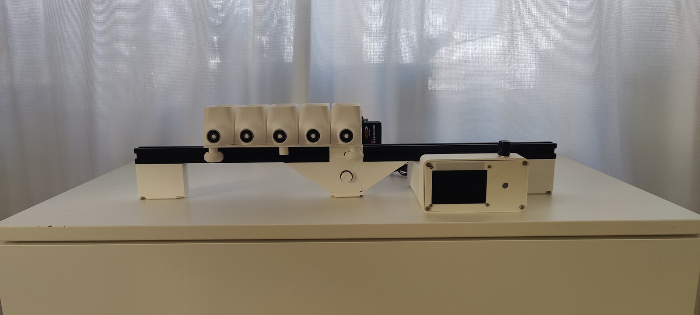
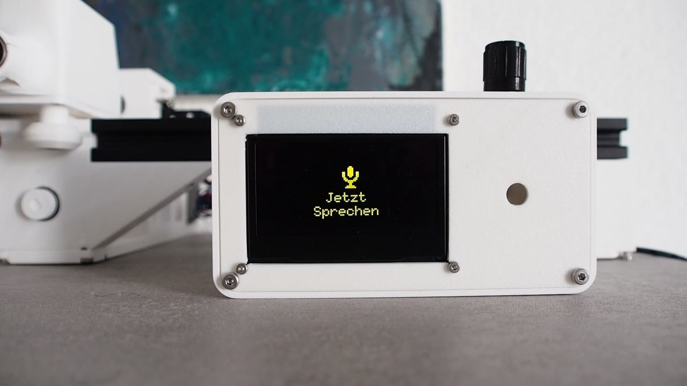
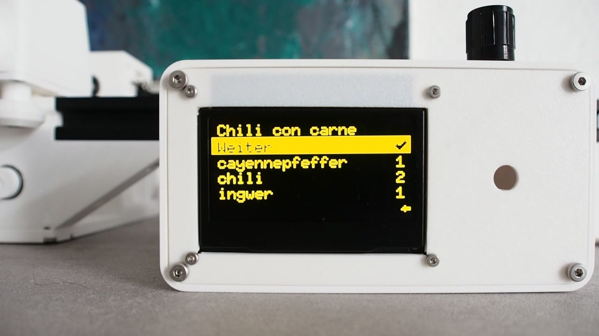
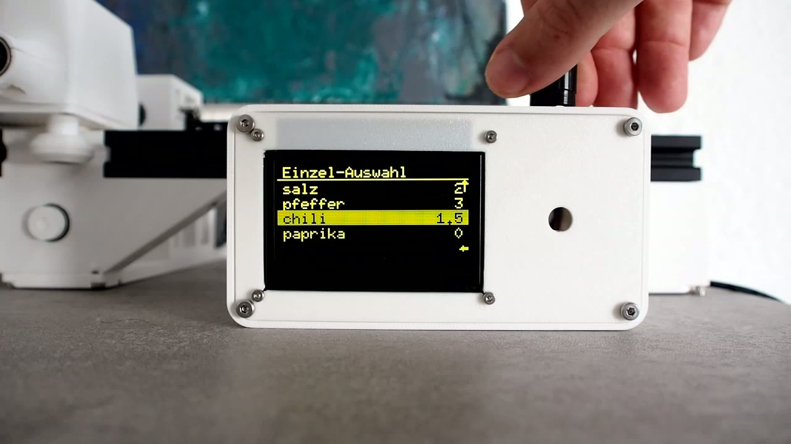
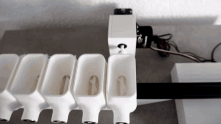
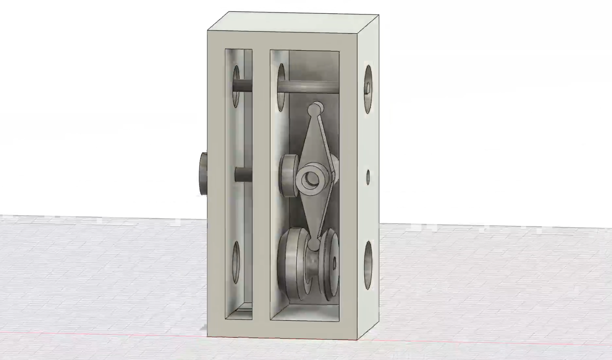
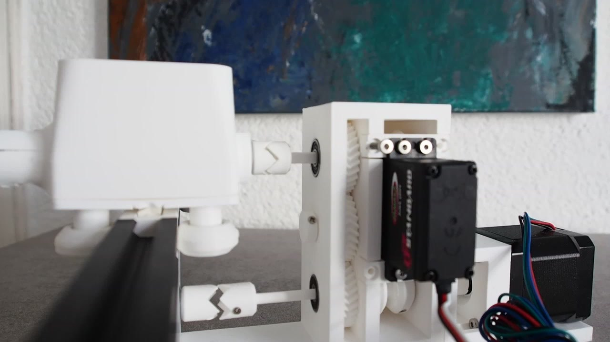

# SpAice: KI-gesteuerter Gewürzautomat

**Gericht nennen (per Sprache oder Text) → ein lokales LLM bestimmt die typischen Gewürze samt Grammmengen → die Maschine dosiert sie automatisch.** Der englische Projekttitel lautet „AI powered Spice Dispenser“. Das Gerät verbindet Konstruktion, KI-Anbindung, Spracherkennung und Hardware-Steuerung.

*Die Maschine: fünf 3D-gedruckte Gewürzbehälter auf einer Linearachse, darunter der Trichter-Auslauf, rechts die Bedienbox mit OLED-Display und Drehknopf.*

▶️ **[Demo-Video auf YouTube](https://youtu.be/kATW5-pVZzE)**

| | |
|---|---|
| Kontext | Kurs Sketching with Hardware, LMU München, SoSe 2025 |
| Rolle | Konstruktion (CAD, 3D-Druck, Getriebe), Firmware, Host-Software, Hardware-Ansteuerung |
| Code | [Piibo/SpiceDispenser](https://github.com/Piibo/SpiceDispenser) |

## Die Idee

Im Kurs Sketching with Hardware habe ich in einem Semester aus einer eigenen Idee einen funktionsfähigen physischen Prototyp gebaut, mit Elektronik, Mechanik, Software und Demo-Video. Die Idee: Beim Kochen weiß man oft nicht, *welche* Gewürze in welcher Menge zu einem Gericht passen. Also soll eine Maschine das wissen und gleich selbst dosieren.

## Wie es funktioniert

1. **Eingabe:** Man nennt ein Gericht, getippt oder gesprochen. Die Spracheingabe läuft komplett lokal über faster-whisper mit Voice-Activity-Detection (webrtcvad).
2. **Gewürz-Bestimmung (Python-Host):** Ein lokales LLM (Ollama, Mistral) erzeugt eine JSON-Liste typischer Gewürze mit Mengen in Gramm, skalierbar nach Portionen und Schärfegrad. Damit das robust bleibt: Wikipedia-Plausibilitätscheck (DE/EN), ob es das Gericht wirklich gibt; Synonym-Normalisierung und Fuzzy-Abgleich gegen eine Gewürz-Whitelist; Fallback-Modus, wenn das LLM kein valides JSON liefert; harte Unter- und weiche Obergrenzen mit Warnungen bei unplausiblen Mengen.
3. **Dosierung (ESP32-Firmware):** Der Host schickt das Ergebnis an einen ESP32-C6. Ein einziger Schrittmotor erledigt beides: Er fährt die Behälterreihe auf der Linearachse zum richtigen Gewürz und dreht dann dessen Förderschnecke, die die Menge in kalibrierten Umdrehungen ausgibt. Ein Servo koppelt dafür zwischen Fahren und Ausgeben um. Dazu entprellte Taster-Bedienung und JSON-Verarbeitung direkt auf dem Mikrocontroller.

*Links: Spracheingabe am Gerät („Jetzt Sprechen“). Rechts: das LLM-Ergebnis für „Chili con carne“ mit Cayennepfeffer, Chili und Ingwer samt Mengen, direkt auf dem OLED zum Bestätigen.*

Ohne KI geht es auch: Im Modus **„Einzel-Auswahl“** stellt man die Menge jedes Gewürzes selbst per Drehknopf ein, in 0,5-Gramm-Schritten. Die Behälter lassen sich per Sprache neu belegen; der Gewürzname wird dabei gegen eine feste Liste geprüft.

*Manueller Modus: Salz, Pfeffer, Chili und Paprika mit selbst gewählten Mengen, eingestellt über den Drehknopf.*

## Die Konstruktion

Gewürzbehälter mit Dosiermechanik, Antriebseinheit, Trichter und Gehäuse habe ich in Fusion 360 konstruiert und im 3D-Druck gefertigt; montiert ist alles auf einer Aluminium-Profilschiene.

*Aus den Videoaufnahmen: Der Schrittmotor verschiebt die Behälterreihe auf der Linearachse zum nächsten Gewürz.*

*Die Kraftübertragung der Antriebseinheit: links der CAD-Entwurf, rechts das gedruckte Ergebnis mit Zahnrädern, Servo und Schrittmotor.*

## Herausforderungen und Lösungen

| Problem | Lösung |
|---|---|
| Schrittmotor und Servo liefen anfangs nicht synchron, Behälter und Dosierer standen nicht genau übereinander | angepasste Dosierregel und präzisere Mechanik |
| Die Display-Bibliotheken ließen sich unter ESP-IDF nicht nutzen | Wechsel auf das Arduino-Framework, Bibliotheken angepasst |
| Für unbekannte Gerichte erfand das LLM Gewürze | strikte Prompts, Wikipedia-Abgleich und Gewürz-Whitelist (siehe oben) |
| Spracheingabe in eine einfache Bedienung einbauen | Drehknopf für alles, was präzise sein muss, Sprache für die KI-Aufgaben |

## Was ich als Nächstes verbessern würde

- Mikrofon ins Gerät einbauen (bisher extern)
- Waage integrieren, damit die Mengen genauer werden
- Kopplungsmechanismus zuverlässiger machen
- Behälter im Kreis statt in einer Reihe anordnen, das spart Platz
- Gewürzempfehlungen der KI verfeinern und die freihändige Bedienung verbessern

## Technologien

| Ebene | Eingesetzt |
|---|---|
| Konstruktion | CAD in Fusion 360 · 3D-Druck · Zahnrad-Getriebe · Aluminium-Profilschiene · Schrittmotor + Servo |
| Firmware (~1.800 Zeilen C/C++) | ESP32-C6 · Arduino-Framework · PlatformIO · ESP32Servo · ArduinoJson · U8g2 |
| Host (~630 Zeilen Python) | Python · Ollama (Mistral, lokal) · faster-whisper · webrtcvad · Wikipedia-API · FastAPI (Verbindung zum ESP32 per WLAN) |
